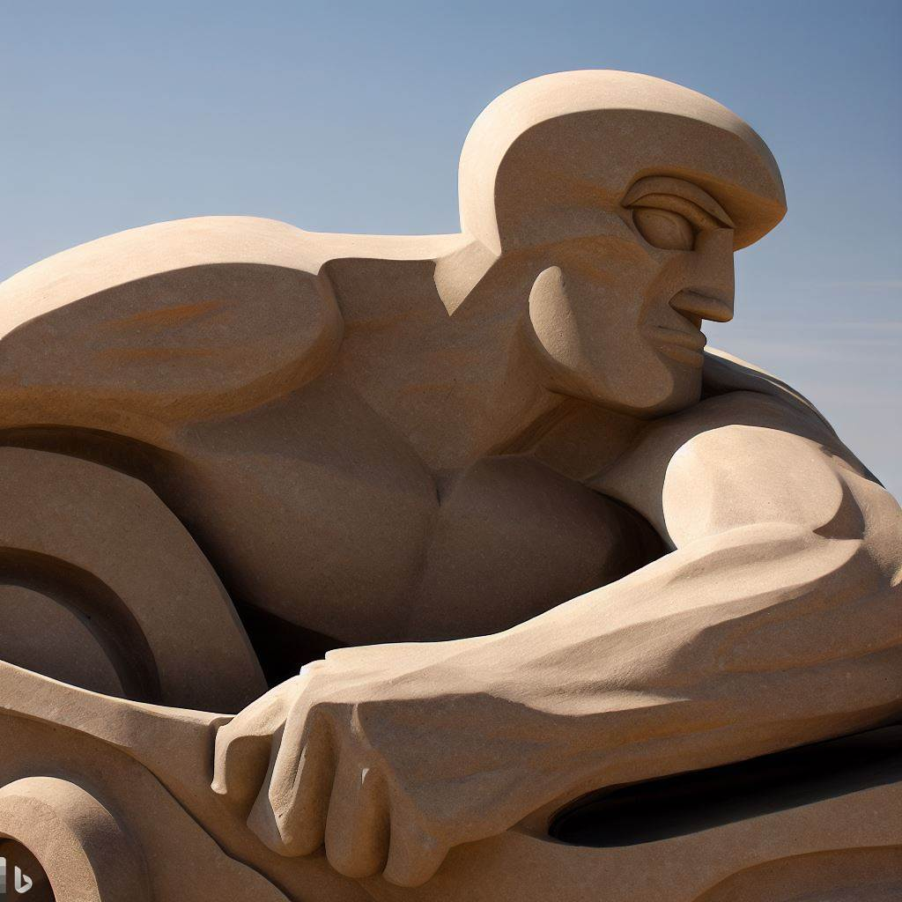
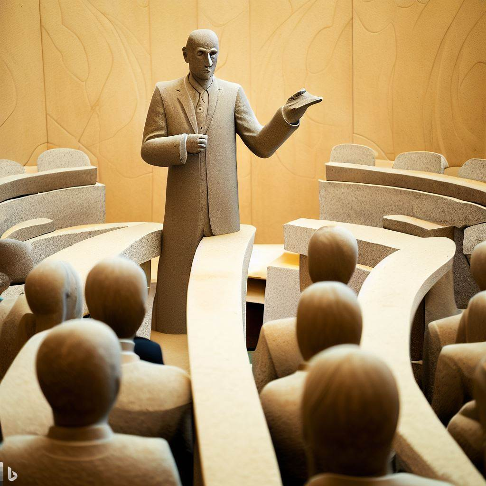

# مونولوگی در خودآگاهی، آداب تجارت و مدیریت

نویسنده این جملات، هرگز دوست نداشتم کسی رو به کاری تشویق کنم که خودم انجام نمی‌دم. اتفاقا هدف هم این نیست. هدفم جمع‌آوری مطالبی بوده که با مرورکردنش به خاطر بیارم که مسیر درست‌تر کدام مسیره. باری. بعضی از پندها به قدری زیبا و تاثیرگذار و عملی هستند که جای اونها در این مجموعه الکترونیکی خالی بود. مواردی که میشه روزانه یا هفتگی مرور کرد و در زندگی به کار بست. خیلی از این موارد رو میشه به گفتگو و آزمایش گذاشت. هر کدام از سرزمینی و دورانی به دست ما رسیدن. این مطالب اینجا جمع شدن چون الهام بخش هستند. جملاتی که میشه روی اون‌ها فکر کرد و امیدوارم به همون اندازه که به من کمک کرده برای بعضی از تصمیم‌ها، به مخاطب عزیز هم کمک کنه. این یک مطلب علمی نیست؛ به این معنی که از تعریف «روش علمی» پیروی نکرده. اما به چشم یک مونولوگ یا گپ دوستانه، می‌شه با فنجانی چای اون رو مرور کرد.

نباید فراموش کرد که توسعه‌ی فردی و توسعه‌ی کسب و کار این روزها بسیار تخصصی شدن. مخصوصا روان‌شناسی که در برخی موارد مرزهای مشخصی نسبت به سایر علوم نداره و یکی از مسیرهای علمه که تقریبا همه خواسته یا ناخواسته در موردش نظراتی رو دادن. واضح‌ترین مثال‌های دخالت افراد در علوم روان رو می‌شه در مربی‌گری، اشعار، سخنرانی‌های انگیزشی و غیره دید. ضمن اینکه لازمه روان‌شناسی زرد و ابعادش رو درست بشناسیم، همیشه نیاز به راهنمایی مشاور متخصص هست و نباید ساده از کنار بعضی احوال گذشت. همچنین می‌دانیم که این گذاره‌ها نسبی هستن. درباره مواردی که در این مجموعه گفته می‌شن هم لزوم هشیاری مخاطب صادقه. الزاما مواردی که گفته می‌شه برای همه کار نمی‌کنه.

بعضی از این مطالب رو به تجربه یادگرفتم و از افراد مختلف شنیدم. بعضی‌ها رو توی متون تاریخی یا مذهبی خواندم و بعضی‌ها رو هم از داخل کتابی ایده گرفتم. تا جایی که به خاطر داشتم، منابع رو ذکر کردم.

در مورد ریا: گفته می‌شه اگر کاری در  حضور یا عدم حضور دیگران یکسان انجام بشه، ریا نیست. و از طرفی جمله‌ی جالبی از نویسنده‌ی ناشناسی خواندم که نوشته بود «ریا کنید اما اجازه بدید چرخه‌ی نیکی ادامه پیدا کنه».

امروز بزرگترین آرزویی که برای خودم دارم اینه که به جایی برسم که همواره در حال تحسین کردن پدیده‌های اطرافم باشم. و این لذت بی‌انتها رو زمانی به دست خواهم آورد که شگفتی‌های پشت صحنه رو بفهمم.

## به علوم بنیادی بپرداز

علوم بنیادی و بنیاد علوم مهم هستن. به همون دلیلی که توی خیلی از پروژه‌ها می‌بینید که چیزی رو مهندسی معکوس کرده ولی صاحب اون صنعت نشده یا در توسعه‌ی نسخه‌ی بعدی اون چیز موفق نبوده.

اگر ریاضی رو مطالعه میکنیم، اگر تاریخ میخوانیم، اگر فیزیک، شیمی، و غیره رو دنبال میکنیم برای اینه که این‌ها واقعا در نهایت به «صاحب سبک» بودن ختم میشن و برای ما استقلال فراهم میکنن و باعث میشن از منابعی که داریم درست و موثر استفاده کنیم.

## برای کسی لقب تعیین نکن ولی برای خودت یه عنوان انتخاب کن و بهش پایبند باش

انتخاب کردن لقب برای دیگران کار خوبی نیست. حتی اگر لقب مثبتی باشه. چون وقتی که صفتی رو برای کسی انتخاب می‌کنیم او رو محدود به اون صفت کردیم (حتی مثبت؛ البته همیشه استثنا داریم) و البته تاثیر تغییرات رو در افراد کم‌رنگ دیدیم. پس بهتره این کار رو برای دیگران نکنیم.

اما اینکه عنوانی رو برای خودمان انتخاب کنیم کمی متفاوته. اینجا ما عمدا به دنبال محدود کردن دامنه‌ی فعالیت‌هامان هستیم و می‌خوایم جلوی پرسه زدن‌های اضافی رو بگیریم.

برای مثال اگر من با خودم کنار بیام که یه راننده هستم، یا یه پزشک، یا یه فضانورد، یا یه پلیس، یا یه معلم؛ احتمال اینکه تمرکزم روی کارم بیشتر باشه و راحت‌تر به موقعیت‌های دیگه «نه» بگم بیشتره.

آدم‌هایی هستن که با پذیرفتن اینکه برای مدتی بیخیال بقیه‌ی استعداد‌هایی که دارن بشن، و به یکی از عناوین حرفه‌ای قناعت کنن، باعث می‌شه که با ترس کمتری از جاماندن (FOMO) زندگی کنن. بنابراین می‌توانه فایده‌هایی رو برای اون‌ها داشته باشه.

در نتیجه به افراد در محیط کار هم عناوین حرفه‌ای – البته به صورت امانت – اختصاص بدید و همچنین به آنچه برای خودتان انتخاب کردید پایبند باشید.

## یک سر و هزار سودا: در جستجوی سارقِ ارزشمند‌ترین دارایی

ارزشمندترین دارایی ما زمان ماست. اگر به این باور نرسیدیم، پس پاراگراف‌های بعدی در این عنوان به کار ما نمیاد.

به هر دلیلی مثل وضعیت‌های روانی مختلف شامل اختلال‌های توجه و تمرکز، شغل آدما ممکنه دچار چالش‌هایی بشه. چالش‌هایی مثل باز بودن پرونده‌های نیمه‌کاره‌ی زیاد و پروژه‌هایی که به ثمر نمی‌شینن. در نتیجه امکان نقد کردن خیلی از فعالیت‌های انجام شده وجود نداره و با کاهش نقدینگی هم رو به رو خواهیم شد. به صورت خلاصه بخوام بگم، این مشخصات افرادیه که چندین هنر دارند اما از نظر مالی وضعیت مناسبی ندارند.

نباید ساده از کنار این موضوع گذشت که متخصصین در این مورد راهکارهایی دارن.

اما در جایگاه مربی‌گری کسب و کار باید بگیم که خیلی از این افراد در هدف‌گذاری و برنامه‌ریزی و اجرای اون‌ها رو به درستی انجام نمی‌دن. نداشتن یک هدفِ «درست» باعث می‌شه که افراد به سادگی از مسیر منحرف بشن. یا انگیزه‌ای برای رو به رویی با چالش‌هایی که توی مسیر پیش میاد نداشته باشن.

## یکی از بهترین راه‌های تمرکز، حذف کردن حواس‌پرتی‌هاست

یکی از بزرگترین چالش‌های دوران معاصر اینه که تمرکز کردن کار بسیار سختی شده. چه در یک زمان و چه در طولانی مدت بر روی یک کاروکسب تا جایی که به صورت عادت و یا اختلال درمیاد. مشخصه که اگر این حواس‌پرتی‌ها دارن روند زندگی و تصمیم‌های ما رو دچار آسیب می‌کنن باید چاره بشن.

باید سعی کنیم که دیسیپلین خودمان رو خیلی به معرض آزمایش نذاریم. مسلمه که مقاومت کردن در برابر یک پارچ آب سرد، بعد از یک پیاده روی طولانی زیر آفتاب، کار ساده‌ای نیست.

*AI generated man holding a glass of water | bing, dall.e*

پس قاعدتا اگر می‌خوایم صبح‌ها رو به چک کردن پیام‌ها و ایمیل‌ها سپری نکنیم، باید گوشی موبایل رو بیرون از اتاق خواب قرار بدیم تا صبح مجبور نباشیم در مقابل این خواسته مقاومت کنیم.

و یا زمانی که لازم داریم کاری رو با تمرکز بالا انجام بدیم، روی درب اتاق، علامت «لطفا بعدا مراجعه کنید» رو نصب کنیم.

وسایل اضافه رو از زندگی حذف کنیم. اون‌ها رو بفروشیم و یا اهدا کنیم.

کتاب‌هایی که برای این بخش از اون‌ها ایده گرفتم:

- 365 Days With Self-Discipline: 365 Life-Altering Thoughts on Self-Control, Mental Resilience, and Success
- [The Power of Habit: Why We Do What We Do in Life and Business](../library/power-of-habit.md)
- Deep Work: Rules for Focused Success in a Distracted World

## دل قوی دار

از کنار اضطراب (به منابع روانشناسی رجوع کنید) نمیشه به سادگی گذشت. اما موضوع در اینجا، اضطراب نیست. بلکه شکه.

یکی از زمان‌هایی که شک در ما به وجود میاد، زمانیه که بیش از اندازه روی نتیجه تمرکز می‌کنیم. اونقدر درگیر نتیجه می‌شیم که فرایند کار از دست می‌ره. این موضوع فقط فردی نیست. مخصوصا توی سازمان‌های کوچ می‌شه دید که افراد هر کاری که می‌خوان بکنن منتظر برگزاری جلسه می‌شن و هیچ‌کس از کاری که می‌کنه مطمئن نیست. حتی ممکنه هزینه‌ی برگزاری جلسه از هزینه‌ی آزمون و خطای افراد در اون مورد خاص بیشتر باشه!

افرادی که در کارهاشان بیش از اینکه روی نتیجه تمرکز کنن، سعی می‌کنن کار رو خوب انجام بدن، رضایت شغلی بالاتری رو تجربه می‌کنن.

- [What is anxiety?](https://www.nhs.uk/every-mind-matters/mental-health-issues/anxiety/)

## کارهای کوچک رو خودت پیگیری نکن

یکی از کسب و کارهایی که با اون‌ها همکاری می‌کردم، زمانی گره از کارشان باز شد، که یک دیالوگ رد و بدل شد:  
+ تعمیر این دستگاه کار کوچیکیه بیا خودمان انجامش بدیم  
– اتفاقا چون کار کوچیکیه باید برون‌سپاریش کنیم

*AI generated man who is taking care of an insect | bing, dall.e*

با برون‌سپاری، کارها تخصصی انجام می‌شن. کاری که برای ما کوچک به حساب میاد و مقرون به صرفه نیست، ممکنه برای کس دیگه‌ای کار مهم و سوداوری باشه.

## گره‌ها رو محکم بزن

اگر باید برای کسی سبد درست کنید، که قراره وسایلش رو داخلش بذاره، باید گره‌ها رو محکم بزنید که زیر فشار، از هم جدا نشه. اگر دارید نرم‌افزاری می‌سازید، تست‌های دقیقی براش طراحی کنید که توی اجرا خراب نشه. اگر دارید خودرو می‌سازید، نباید توی یه برخورد معمولی، مثل دستمال‌کاغذی مچاله بشه. کار رو باید محکم انجام داد.

*AI generated man, knotting needle leaves to make a basket | bing, dall.e*

## کارها رو سریع انجام بده

معمولا وقتی که مشتری سراغ ما میاد، زمانی شده که احساس نیاز به خدمات ما کرده. این یعنی همینطوریش هم دیر شده برای اینکه به چیزی که می‌خواد برسه. سریع انجام دادن کارها باعث می‌شه مشتری‌ها همچنان انگیزه داشته باشن که کارشان رو توسعه بدن و مشخصا باعث ادامه‌ی همکاری با ما هم می‌شه.

*AI generated man riding a fast vehicle | bing, dall.e*

همیشه می‌شه کارها رو سریع‌تر انجام داد. با ایجاد روندهای چابک‌تر، استفاده از روش‌های مناسب‌تر، ساختن ابزار و ایجاد همکاری‌های جدید. این بهترین انگیزه است که دائما پیشرفت کنیم و سودآور باشیم.

سریع انجام دادن کارها باعث می‌شه که کمی از کمال‌گرایی هم در امان باشیم. زمانی که کارها رو سریع انجام می‌دیم فرصت برای نشخوار ذهنی کم میشه و در نتیجه بهره‌وری هم در طول زمان بالاتر می‌ره.

## اگر در برنامه‌ریزی شکست بخورید، برنامه ریختید که شکست بخورید.

برنامه ریزی آدابی داره. اینکه صرفا روی گوشه‌ی کاغذی بنویسیم که چه کارهایی برای یک روز داریم، معمولا جواب نمیده.

چد روز پیش گفتگویی از یک بازیکن فوتبال آمریکایی گوش می‌دادم که در مورد هدف‌گذاری صحبت  می‌کرد. جمله‌ی بسیار جالبی داره که می‌گه «رسیدن به یک هدف، جریمه‌ی قرار دادن اون هدفه!» و منظور از این جمله اینه که هدف‌ها می‌توانند آدم‌ها رو نسبت به موقعیت‌های بهتری که می‌توانند به دست بیارن محدود کنن. اما کاملا هدف‌گذاری رو منع نمی‌کنه. در ادامه می‌گه هدف‌گذاری برای اهداف خیلی کوچک لازمه. مثلا کارهایی که باید در طی یک روز انجام بشن و با عبارت «هدف‌های خُرد برای چشم‌انداز کلان» استفاده می‌کنه.

در ادامه‌ی اون گفتگو، به بررسی تفاوت «تاثیرگذاری» و «موفقیت» پرداخته می‌شه. صحبت از این بود که موفقیت قائم به شخصه اما تاثیرگذار بودن، یعنی تاثیر گذاشتن روی کار، جهان، شخص و غیره. در نتیجه کسی که به دنبال دومیه، هر دو رو داره.

همچنین «[امانوئل آچو](https://en.wikipedia.org/wiki/Emmanuel_Acho)» به این نکته اشاره می‌کنه که دلیل جاماندن برخی از گروه‌های اقلیت از پیشرفت، به دلیل اینه که به دنبال جوابی نیستن که احتیاج دارند، بلکه در جایی که انتظار دارن به اون جواب برسن جستجو می‌کنن. حرفی رو از مربی خودش نقل می‌کنه که بهش گفته بود «مثل آب نباش که آسان‌ترین راه رو انتخاب کنی». وقتی که به درون خودمان نگاه می‌کنیم می‌بینیم که روش ما، گشتن به دنبال راه‌های آسان‌تره. و برای تمرین دادن ذهن برای آگاه شدن به این موضوع، مثالی رو از فروشگاه‌ها میاره که مسیرهای آسانی رو برای حرکت آدم‌ها طراحی می‌کنن و او این مسیرها رو تغییر می‌ده تا ذهنش رو تربیت کنه که با راحتی مقابله کنه. و این کجا به کار میاد؟ اونجایی که می‌گه هدف‌گذاری کار آسانیه که نباید در سطح کلان انجام بشه مثل هدفی که می‌گه تا ۲۸ سالگی می‌خوام ۱۰۰ هزار دلار داشته باشم و دیگه به این فکر نمی‌کنیم که چه کارهایی دیگه می‌شه انجام داد. در حالی که زندگی با شرایط اینکه هر روز چالشی برای عالی شدن باشه خیلی دشوارتره.

- [The problem with setting goals with NFL linebacker Emmanuel Acho](https://www.ted.com/podcasts/problem-with-setting-goals-emmanuel-acho-transcript)

## مشورت کن

همه خیلی زیاد شنیدیم که باید در کارها مشورت کرد. در کنار همه‌ی جنبه‌های مثبتی که مشورت کردن داره، مثل اینکه اطلاعات گسترده‌تری رو توی تصمیم‌گیری دخالت می‌دیم و جنبه‌های پنهان تصمیم‌گیری‌ها رو بهتر می‌بینیم، اینه که از سوگیری «تعهد اولیه» رها می‌شیم. حتی زمانی که در مورد خاصی بیشترین دانش یا تجربه رو داریم، مشورت کردن باعث می‌شه در مقابل این تعهد ذهنی منطقی‌تر تصمیم بگیریم.

*AI generated man presenting a lecture in curved lecture auditoria hall | bing, dall.e*

سوگیری «تعهد اولیه» یکی از سوگیری‌های شناختی ما انسان‌هاست. زمانی که تصمیمی رو می‌گیریم، معمولا اطلاعاتی که باورهای اولیه‌ی ما رو نقض کنن رو نادیده می‌گیریم و یا سعی می‌کنیم تاثیر اون‌ها رو کمتر از چیزی که هست در نظر بگیریم.

یکی از بهترین راه‌ها برای اینکه تصمیمی منطقی‌تر بگیریم اینه که با دیگری مشورت کنیم. او تعهدهای اولیه‌ی ما رو نسبت به مسئله نداره و در نتیجه می‌توانیم به این وسیله، به این سوگیری آگاه بشیم.

- [The art of negotiation: Six must-have strategies | London Business School](https://www.youtube.com/watch?v=uKbcmlKb81c)

## کار «انجام شده» از «بی‌نقص» بهتره

بعضی از شغل‌ها به واسطه‌ی دیرینه‌ای که دارن، تعرفه‌هایی برای خدمات اون‌ها وجود داره و حتی فرهنگ تثبیت شده‌ای هم دارن. معیارها و شاید سازمان‌هایی هم برای اندازه‌گیری و قیمت‌گذاری کیفیت کار اون‌ها هست. برای مثال آلیاژها با ترکیب‌های مختلفی از فلز‌های گران‌بها مثل طلا، قیمت‌ها و شیوه‌های تحویل متفاوتی دارن.

اما در خیلی از شغل‌های جدیدتر که همه کار فکری بیشتری لازم دارن، اندازه‌گیری کیفیت به مراتب دشوارتره. در مشاغل سنتی، منبع‌ها و مصرف‌های این منابع کاملا مشخص هستند و برای مثال افراد می‌دانند که برای کار درجه دو باید چه مقدار وقت گذاشت و از چه مواد اولیه‌ای استفاده کرد.

همونطور که اشاره کردیم، رعایت این سقف در مشاغل دیگه دشواری‌های خودش رو داره. همچنین در مورد اخلاق چنین شغل‌هایی هم گفتگوهایی شکل می‌گیره و خیلی از پرسش‌ها هنوز بی پاسخ هستن.

نباید فراموش کنیم که اگرچه این بی‌انتها بودن قدرت تفکر و بهینه‌سازی کارها واقعا شگفت‌انگیزه، اما در نهایت ما در جهانی با کاستی‌ها و کمبود برخی منابع زندگی می‌کنیم که یکی از مهم‌ترین اون منابع زمانه. در بسیاری از موارد، زمان از کیفیت بیشتر اهمیت داره. چون کیفیت رو می‌شه به مرور زمان افزایش داد اما بعضی از فرصت‌ها دیگه هرگز بر نمی‌گردن.

## تقلید، کنار دست قدیمی‌تر‌ها

انسان به صورت تاریخی یاد گرفته که اگر دیگری موفق به انجام یک «شکار» بشه، شانس او برای شکار کردن کمتر می‌شه. پس در مقابل این «دستاورد» دیگران حق داشته که احساس ناامنی بکنه.

اما مدت‌هاست که اقتصاد اینطوری کار نمی‌کنه و نعمت‌ها بسیار فراوان شدند و حداقل در سطح خُرد، این احساس ناامنی اساس محکمی نداره چون همیشه جایگزین‌هایی وجود داره.

در نتیجه باید مراقب این ذهنیت بود که «کنار» افرادی باشیم که ارزیابی می‌کنیم «موفق» هستند و نه اینکه «مقابل» اون‌ها بایستیم.

تقلید یکی از راه‌های بیرون رفتن از وضعیت بلاتکلیفی هستش. اگرچه راهکارهای اختصاصی که درست طراحی شده باشند برای ما بهترن، اما تقلید درست، از درجا زدن و ناامیدی بهتره.

زمان‌هایی که ناامید یا کم‌اطلاع هستیم، تقلید می‌توانه ما رو از افتادن در دام کمال‌گرایی نجات بده و از نقطه‌ای که هستیم جابجا کنه. و لازم به تاکید دوباره نیست که اندازه‌ی هرچیزی رو باید نگه داشت.

## کمترین منابع، بیشترین خلاقیت

کمی قبل، در مورد کمبود منابع در جهانی که در اون زندگی می‌کنیم صحبت کردیم. چیزی که پایه و اساس علم اقتصاد رو تشکیل می‌ده. به طوری که بسیاری از افراد غلم اقتصاد رو با تعریف «علم تخصیص بهینه‌ی منابع محدود به نیازهای نامحدود» می‌شناسند.

نباید این تعریف ما رو گمراه کنه و فرضی رو به ما القا کنه که اگر منابع محدود هستند پس غیر قابل تغییر هستند و یا حتما یک سری از منابع باید به یک سری از نیازها مرتبط باشن.

بسیاری از موارد خام که قبلا برای نیازهای دیگری مصرف می‌شدند، امروز فراوری شدن و در صنعت‌های دیگه استفاده می‌شن.

یکی از راه‌های جبران کردن کمبود منابع، استفاده کردن از خلاقیته. تعریفی که من از خلاقیت دارم «نوآوری در چیدمان لوازم موجود» است. این تعریف کمک می‌کنه که خلاقیت پدیده‌ای کمتر ناشناخته باشه و بشه در موردش گفتگو کرد و یا به یک خواسته و حتی عادت تبدیلش کرد.

## آزادی یعنی خود انضباطی

جمله‌ی معروفی از ارسطو هست که می‌گه «آزادی با دیسیپلین به دست میاد» و یا جمله‌ی مشابهی از آیزنهاور که خالق ماتریس اولویت‌بندی هم هست که می‌گه «آزادی یعنی خود انضباطی».

و یکی از لازمه‌های حفظ کردن دیسیپلین، انتخاب سبک زندگی متناسب با چهارچوب رفتاریه که برای خودمان تعیین می‌کنیم.

پیروی کردن از برخی از اصول کمینه‌گرایی (مینیمالیسم) برای ساختن دیسیپلین خیلی کمک می‌کنه. آقای [ریموند کورتزوایل](https://en.wikipedia.org/wiki/Ray_Kurzweil) که یک مخترع معاصره، می‌گه «شاکله‌ی کار هوشمندانه، حذف هوشمندانه‌ی اطلاعاته» که با سبک زندگی این روزها خیلی جور در میاد. آدم‌ها می‌توانند تجملات رو به زندگیشان اضافه کنن اما این به قیمت از دست‌رفتن آرزوها و امیدهای اون‌ها خواهد بود.

- “The purposeful destruction of information is the essence of intelligent work.” – Ray Kurzweil
- “Through discipline comes freedom.” – Aristotle
- Luxury comes at the cost of killing your hopes, your dreams, your ambitions. So toughen up.” – Tai Lopez

## بازار، کاری به شرایط و باورها و انتظارهای ما نداره

مسیر بازارها رو بازیگرهایی تعیین می‌کنن که قدرت تغییر دادن روند‌هاش رو دارن. بسیاری از بازارها اونقدر بزرگ هستند که حتی مجموع بازیگران خرد نمی‌توانن با حرکت بازیگرهای بزرگ رقابت کنن. در این‌جا، خطاهای ادراکی فراوانی صورت می‌گیره که باعث می‌شه افراد در تصورات خودشان از دنیای بیرون و نه در خود اون دنیا زندگی کنن. همه‌ی انسان‌ها مستعد چنین خطایی از محیط اطراف خودشان هستنند.

برای مثال خیلی از افراد در دام معاملات زیان‌ده می‌افتن چون به دنبال انتقام گرفتن از بازار هستن. احساسی که پشت این رفتار هست، تمایل افراد برای جبران هرچه سریع‌تر ضرری است که اخیرا متحمل شدن. در نتیجه بدون فکر و فقط برای جبران زیان‌های قبلی اقدام به تکرار کارهای مختلفی می‌کنن.

خطاهای دیگری هم وجود داره. مثل اینکه افراد انتظار دارند اگر روی محصولی سرمایه‌گذاری کردن، بازیگرهای مهم هم با اون‌ها هم‌نظر باشن و اون‌ها سود کنن. زمانی که در این دام می‌افتند، دائما به دنبال داده‌هایی برای تایید فرضیه‌ی سودده بودن معامله‌ای که انجام دادن می‌گردن در نتیجه اطلاعات مخالف باور خودشان رو نادیده می‌گیرن و همین باعث ضرر اون‌ها می‌شه.

## مهارت یک معمار در معماری خانه‌اش بروز می‌کنه

پدر یکی از همکارها، قصه‌ی یکی از معمارهای مطرح جهان رو گفته بودند که در یکی از شاهکارهای خودش زندگی می‌کنه.

در مورد این شنیدیم که عمدتا کارمندهای شرکت اپل از محصولات این شرکت استفاده می‌کنن در حالی که اجباری برای این موضوع نیست.

دیوید آگیلوی جمله‌ی معروفی داره که می‌گه «نمی‌توانید با زبان‌بازی یک متن تبلیغاتی خوب بنویسید. بلکه باید به محصول باور داشته باشید.» و این نشان می‌ده که محصول باید ارزنده باشه.

- “Good copy can’t be written with tongue in cheek, written just for a living. You’ve got to believe in the product.” – David Ogilvy

## روی کاغذ بنویس که داری به چی فکر می‌کنی

یکی از راه‌هایی که می‌شه با اون به آرامش و تمرکز رسید اینه که روی کاغذ بنویسید که دارید در اون لحظه به چی فکر می‌کنید. این روش آقای علی رجبی (حافظ) استفاده می‌کنن.

این روزا که کارها دارن نیاز به تمرکز بیشتری از هر زمان پیدا می‌کنن و ضمنا احتیاج به مهارت‌های نرم خیلی نسبت به قبل بیشتر شده و در نتیجه پردازش دقیق‌تری رو از ذهن احتیاج داریم، و همچنین روش‌های حل مسئله‌ای که قبلا نیاز چندانی به اون‌ها  نبود رو باید انجام بدیم. این‌ها همه باعث می‌شه که لازم داشته باشیم ذهن رو مهار کنیم.

یکی از روش‌های خیلی خوب برای این کار، اینه که «دارم به چی فکر می‌کنم؟» رو بیاریم روی کاغذ. یادداشت برداری کمک می‌کنه بتوانیم ساده‌تر اون‌ها رو مدیریت کنیم و از طرفی آرامشی به ما می‌ده که اون‌ها رو فراموش نخواهیم کرد و در نتیجه باری رو از ذهنمان کم می‌کنیم.

## قبل از انجام معامله، همه‌ی جزییات رو روی کاغذ بیار

هیچ کس شراکت رو شروع نمی‌کنه با امید اینکه به اختلاف بخوره، مگر اینکه کسب و کارش از این راه بگذره که اخلاقی نیست. دنبال حرف‌هایی باشید که فکر می‌کنید بدیهی و واضح هستن. همون‌ها رو بیارید روی کاغذ. اگر دیدید دارید از کلمات کیفی استفاده می‌کنید، هر کلمه‌ی کیفی که براش متر و معیاری ندارید، یه زنگ خطره.

خیلی‌ها فکر می‌کنن که دوستی‌ها بهم می‌خورن و بعد به قرارداد رجوع می‌شه. در صورتی که طبق تجربه‌ی شخصیم، این برعکسه. آدم‌ها انتظارات نامشخصی از همدیگه دارن. انتظارات در ذهن هر کس متفاوته. و اوایل یک رابطه‌ی کاری (و شاید سایر روابط) آدم‌ها با دید مثبت وارد می‌شن و هر نشانه‌ای رو به عنوان تایید پیش‌فرض‌هاشان در نظر می‌گیرن و رابطه تا چند مدت خوب پیش میره. اما وقتی کم کم واقعیت‌ها چیزه می‌شن به تصورات، اتفاقا این وضعیت با بدبینی جایگزین می‌شه.

در واقع نباید انتظار داشت که ما و طرف مقابلمان بدانیم که چی از همکاری می‌خوایم. در نتیجه در حالت ایده‌آل باید همه‌چیز رو مکتوب و تفهیم کنیم. وقتی که همه‌چیز واضح و روشن باشه، مگر در موارد پیش‌بینی نشده‌ای که همیشه وجود داره، اختلافی پیش نمیاد.

باید حتی برای اون حل اختلاف هم سازوکاری باشه.

وقتی که تمام این نکات رعایت شد، وارد یه سطح خیلی جذاب از همدلی می‌شیم. وقتی که منافع طرفین هم‌راستا هستن و درک مشترک وجود داره، راه برای همدلی باز تره.

## معامله با افرادِ ناتوان از انجامِ تعهد، باطله

اگر آگاه هستید به این‌که طرف معامله‌ی شما، قدرت انجام تعهداتش رو نخواهد داشت، این معامله باطله. در واقع اگر به کسی کاری بزرگ‌تر از ظرفیتش می‌سپارید، مقصر شما هستید.

این کار البته نوعی آسیب زدن به طرف ضعیف‌تر هم هست. انگار که کسی که تا به حال پیاده‌روی هم نکرده رو رهسپار قله‌ی الوند کنید. ضمن اینکه اون‌جا یه نفر روی دستتان خواهد ماند و باید چند نفری رو هم پرستار اون فرد کنید، احتمالا از ورزش کردن هم بترسه و دیگه سراغ این کار نره.

یکی از دلایلی که بدون حضور حامی و ولی یک کودک، انجام معاملات با اون کودک ممنوعه. به همین خاطره که کودکانی که وارد بازار کار می‌شن دچار آسیب می‌شن. بچه‌ها به خیلی از زیر و بم‌های روابط انسانی آشنایی ندارن، ساختار جامعه رو درست نمی‌شناسن، و حتی هوش هیجانی کافی برای برقراری یک رابطه و دفاع از حقوق خودشان رو هم ندارند. در نتیجه آسیب‌پذیرترن و ضمن اینکه بهتره اون‌ها وارد تجارت واقعی نشن و توی بازی خیلی چیزها رو یاد بگیرن، در مواردی هم یه خطای واضحه.

باید مراقب این باشیم که «عقده‌ای شدن» یه خطر جدیه که در کمین هر انسانی هست. اگر کسی رو به زور در جایگاهی بذاریم که نمی‌توانه حفظش کنه، ممکنه اصطلاحا عقده‌ای بشه و آسیب روانی جدی بهش وارد بشه.

## اسراف باعث فقر می‌شه

به نظرم یکی از تحسین‌برانگیز‌ترین شعار‌هایی که در ایران تبلیغ شد، شعارِ «صرفه‌جویی کم‌مصرف‌کردن نیست، درست‌مصرف‌کردن است» بود. کمی که وارد جزئیاتش بشیم می‌بینیم شعاری همدلانه با درک دقیقی از هدف پویش تبلیغاتی و جامعه‌ی هدفش بوده.

نباید اسراف رو با بالا نگه داشتن کیفیت زندگی اشتباه گرفت. می‌شه کیفیت زندگی بالایی داشت بدون اینکه اسراف کرد. می‌شه بدون اسراف استانداردهای زندگی رو بالا برد. و اتفاقا می‌شه با صرفه‌جویی افراد رو توانمند کرد تا کیفیت زندگی بالاتری رو تجربه کنن.

فرض کنید به صورت میانگین، یک درصد از سودی که به دست میارید رو خرج جریمه‌ی رانندگی کرده باشید، یک درصد دیگه رو خرج حواس‌پرتی شارژ بیش از نیاز فلان حساب اعتباری، یک درصد دیگه رو بابت دیرکرد فلان وام و یک درصد دیگه رو برای خرید اشتباه کالایی بپردازید.

وقتی که هزینه‌های اضافی زندگی رو جمع می‌زنیم به اعدادی می‌رسیم که قابل توجه هستن. و اگر یک‌جا جمع می‌شدن می‌توانستن تاثیر چشم‌گیری بذارن. با خیلی از این هزینه‌هایی که ناچیز به نظر میان می‌شد کارهای بزرگی کرد.

همین هزینه‌ها رو میشه به مصرف انرژی، غذا، سرگرمی و غیره هم تعمیم داد. و وقتی که وارد سطح کلان یک جامعه می‌شه، عددها اونقدر معنی‌دار می‌شن که می‌توانند سعادت یا ورشکستگی یک ملت رو تعیین کنند.

تاجرهایی که در ابتدای دوران تجارتشان، بازار داغی دارن، دیرتر از دیگران به انضباط مالی می‌رسن و در این مورد بد عادت می‌شن. در نتیجه توی فرودهای بازار احتمال اینکه شکست‌های پرهزینه‌ای رو تجربه کنن بیشتر و بیشتر می‌شه.

- Almost Alchemy: Make Any Business Of Any Size Produce More With Fewer And Less, Dan Kennedy

## به اختیارهای مشتری در معامله احترام بذار

مشتری در یک معامله اختیارهای مختلفی داره. از حق‌هایی که داره برای آگاهی کامل پیش از انجام خرید گرفته تا اختیارهای مختلف برای خروج از یک تعهد.

اگر چه احترام گذاشتن به این حقوق ممکنه در جایی به معنی یک فروش شکست خورده باشه اما اعتبار کسب و کار رو در جامعه بالاتر می‌بره. از طرفی گفته می‌شه که اطمینان دادن به مشتری برای حفظ حقوقش، باعث می‌شه که بهتر اعتماد کنه و راحت‌تر خرید انجام بده. از طرفی حتی اگر تمام این تاثیرهای مستقیم در کسب و کار نباشه، طرفِ مشتری بودن، باعث می‌شه که ایرادهای کسب و کار سریع‌تر توی آمار خودش رو نشان بده. برای مثال اگر دو بنگاه مشابه وجود داشته باشن که یکی سیاست‌های مروجعی ساده‌تری داره، توی آمارش زودتر از رقیبش متوجه اشکالی می‌شه که د کسب و کارش هست.

## همه‌ی کارها مجاز هستن مگر اینکه ممنوع باشن

شنیدید که می‌گن «بیرون از جعبه فکر کن» ولی معمولا تعریف واضحی ازش داده نمی‌شه. خیلی از ما ممنوعیت‌هایی رو برای خودمان در نظر می‌گیریم که نه قانون، نه جامعه، و نه اخلاق اون‌ها رو حکم نکرده. هر چند ممکنه در فرایند تعلیم و تربیت در ما نهادینه شده باشه.

حقیقت اینه که کسب و کار یک میدان رقابته. به این معنی که همیشه در حال پیشرفته. گاهی اوقات «قوی عمل نکردن» هم می‌توانه باعث هزینه برای کسب و کار بشه. و یک روز افراد به این دلیل مورد شماتت قرار بگیرن که با وجود اینکه کارهایشان رو خوب انجام دادن اما عالی نبودن. در بسیاری از بازارها، استانداردها مدام در حال پیشرفت هستن. در نتیجه کسی که عمکلرد ثابتی داره، به تدریج از چرخه‌ی رقابت حذف می‌شه.

در چنین شرایطی باید رویکردی داشته باشیم که بدون نظارت دائمی بر تازه‌های بازار هم کار کنه. رویکردی که هزینه و زمان تصمیم‌گیری رو پایین بیاره. شاید چنین رویکردی رو بشه در یک جهان‌بینی ساده پیدا کرد؛ و اون هم اینکه به جای «چرا» بپرسیم «چرا که نه» و البته به دقت همه‌ی حالت‌هایی که منجر به «نه» می‌شن رو بررسی کنیم.

## نباید سعی کنی که از همه‌ی موقعیت‌های همه‌ی بازارها همزمان سود بگیری

گفته می‌شه «با یک دست چند هندوانه بر ندار» و گفته‌ی بسیار درستیه. اگر بخواید همزمان در تمام موقعیت‌های همه‌ی بازارها حضور داشته باشید، که این می‌توانه به سادگی حضور همزمان در چند معامله‌ی خرید و فروش باشه، یا به پیچیدگی اجرای همزمان چندین پروژه، نباید کار اینطوری پیش بره.

دقیقا مثال‌های نقضی وجود داره که باید به ظرافت اون‌ها دقت کرد. هولدینگ‌های بزرگی هستن که دارن توی چند پروژه همزمان کار می‌کنن و در چندین بازار فعالیت دارند. دلیل موفقیت این‌ها اینه که اتفاقا این‌ها هم دارن یک کار رو انجام می‌دن و اون هم مشارکت در فعالیت‌های اقتصادی با یک سیستم تصمیم‌گیری و اساسنامه‌ی ثابته که بهش پایبند هستن و دائما بهبودش می‌دن. و نکته‌ی ظریف دیگری که وجود داره، وجود تیم‌های هماهنگ در این سازمان‌ها است. هم‌افزایی در یک تیم هماهنگ می‌توانه خروجی بیشتری از چند نفر بگیره که تنها کار می‌کنن به این دلیل که فعالیت‌ها دسته‌بندی بشن و توسط افراد مختلف اجرا بشن. که باعث میشه هر فرد به گروهی از کارها بپردازه که تخصصی کار کردن رو در پی داره.

## شو، ها، ری

آن‌چه خرد سنتی به آن رسیده است را به خوبی یاد بگیر  
زمانی که بر آن مسلط شدی خلاقیت را چاشنی کن  
و سپس آزادانه حرکت‌ها را انجام بده

- پادکست 100 MBA

## کینتسوگی

گفته میشه که در دوران قدیم، یکی از امپراتورهای ژاپن، متوجه شکسته شدن ظرفی میشه که بهش علاقه داشته. اون رو برای تعمیر به چین می‌فرسته. وقتی که ظرف به دستش می‌رسه، با مواد و هندسه‌ای زمخت ترمیمش کرده بودن. دستور میده تا صنعتگران ژاپن روش دیگری برای ترمیم ظرف‌های چینی پیدا کنن. خلاصه، هنر کینتسوگی به وجود میاد که در اون ظروفی که شکسته میشن، با ترکیب‌های ارزشمندی مثل پودر طلا، بازسازی میشن.

پیام مهمی که این هنر داره، ارزش موجودیت‌هاییه که تاریخچه‌ای دارن. روابط، ابزار، مکان‌ها، مهارت‌ها، مفهوم‌های و غیره.

*این تصویر توسط هوش مصنوعی bing به واسطه‌ی Skype ساخته شده است.*

## نسبت به «اقتصاد توجه» آگاه باشید

پیش‌فرض نچندان جامعی وجود داره که می‌گه انسان‌ها به عنوان بازیگران اقتصاد، بر اساس نفع شخصی تصمیم‌گیری می‌کنن. و منظوری که از «نفع شخصی» بوده رو تطبیق میدن روی مفاهیم نسل‌های قبلی حسابداری مثل «سود» و «زیان» و «بهای تمام شده».  
  
امروز به نظر میاد که منافع شخصی افراد فراتر از محاسبه‌ی ریالی یک موقعیت باشه.  
  
در نتیجه اقتصاد برای تحلیل خیلی چیزها به ریشه‌های خودش در علوم بنیادی بر میگرده و روانشناسی و جامعه‌شناسی حرف‌هایی برای گفتن پیدا می‌کنن.  
  
مثل اینکه «گفتمان غالب»، «فرهنگ» و «عادت‌ها» و غیره بستری رو می‌سازه که تاثیر زیادی روی معیارهای افراد در مورد نفع شخصی می‌ذاره.

یک کلمه‌ای هست که این روزا درگیرشم به اسم «اقتصاد توجه» نمیدانم شنیدمش، خواندمش، یا ناخودآگاهم ساخته؛ اقتصاد توجه اینطوری کار می‌کنه که آدما به جای اینکه روی کارهای اساسی که جی‌دی‌پی رو می‌بره بالا تمرکز کنن، روی چیزایی تمرکز کنن که به درد نمیخوره.

## هر چیزی که می‌خواید رو دارید

توی کسب و کار، معطل این نشید که بگید برای شروع کردن زوده، و لازم دارم یک کتاب دیگه بخوانم یا لازم دارم کمی بیشتر وقت بگذره.

شاید می‌خواید یه کاری رو شروع کنید که محورش تخصصیه که شما ندارید؛ حتی در این شرایط هم می‌توانید مقدمات حداقلی رو فراهم کنید و حین فراهم کردن اون مقدمه‌ها، دانش خودتان رو افزایش بدید.

همه‌ی کارها جنبه‌های غیرتخصصی بسیار مهمی دارن که بسیار با اهمیته. مثلا اگر می‌خواید یه نرم‌افزار بسازید و نمی‌دانید چطوری این کار انجام می‌شه، شروع کنید به بازاریابی، تحقیقات بازار، تحقیقات بازاریابی، و طراحی کردن نمونه‌های اولیه‌ی محصول با ابزارهای آماده. و بعد درگیر مهندسیش بشید.

## در کارهایی که زمانی رو باید منتظر باشید، حتما راه‌کار جایگزین داشته باشید

همیشه به این فکر کنید که وقتی کاری رو به دیگران می‌سپارید، تعلل اون‌ها می‌توانه منجر به این بشه که شما انگیزه‌ی کار رو از دست بدید. در چنین مواقعی یه زمانی رو به عنوان خط قرمز در نظر بگیرید که اگر اون کار انجام نشد، به نفر دیگه‌ای بسپاریدش، یا خودتان انجامش بدید. همچنین در طی این زمان، در بازه‌های زمانی مرتبی، گزارش بخواهید و پیگیری کارها رو انجام بدید.

## تلاشه که باید تحسین بشه، نه هوش و استعداد

خیلی گفتن و خیلی شنیدیم. تعریف کردن از نعمت‌های خدادادی دیگران، هنر ظریفیه که زمان و جای مناسب خودش رو می‌طلبه. در رابطه با یک دانش‌آموز، یا کارمند، این‌که دائما از هوش و استعدادش تعریف کنیم باعث سرخوردگیش در مواقعی می‌شه که گره توی کار می‌افته.

زمانی که «موفقیت» افراد رو در گرو چیزی می‌ذارید که دخل و تصرفی توش نداشتن، مثل هوش، باعث می‌شه زمان‌هایی که کار به اقتضای خودش دچار پیچیدگی می‌شه، ریسمانی بشه که به اعتماد به نفس اون فرد ختم می‌شه. با جمله‌هایی که «حتما به اندازه‌ی کافی باهوش نیستم که از پس این کار بر نمیام». در حالی که طبیعت هر کاری همینه. در مهندسی، ممکنه چندین روز درگیر مورد ساده‌ای باشن. ممکنه در تجارت، مدتی کم درامد باشن. و این‌ها طبیعت هر کاریه.

## دوبار گوش کن، یک‌بار حرف بزن

مهارت «شنوندگی فعال» یک مهارت پیشرفته است. هزاران سوگیری در مورد هر کسی وجود داره و هزاران نویز مختلف در برداشت و انتقال پیام هست. پس فهمیدن منظور دیگران کار ساده‌ای نیست.

اما حداقلش اینه که یک بار گوش کنیم و یک بار به اون مطالب فکر کنیم. بار اول احتمالا با سوگیری‌هایی رو به رو می‌شیم. مثل اینکه فکر می‌کنیم موضوع رو کاملا فهمیدیم، یا اینکه احساس می‌کنیم همون چیزیه که باید باهاش موافق نباشیم. در حالی که وقتی دوباره و چندباره بهش فکر می‌کنیم، ریخت عوض می‌کنه و شانس پیروزی ما افزایش پیدا می‌کنه.

## دوبار فکر کن، یک‌بار انجام بده

فکر کردن کار سختیه. اما سخت‌تر نیست از رو به رویی با نتیجه‌ی کار بی‌فکر. این رو بیشتر در مورد کار مهندسی می‌گم. توی کارهای مهندسی، مثل بازی شطرنج، همیشه یه راه بهتری هست. به نظر میاد که دوبار فکر کردن عدد مناسبی باشه. معمولا اون لحظه‌ای که فکر می‌کنیم «همین روش مناسبه» باید جلوی دست‌هامان رو بگیریم، عقب بایستیم و دوباره فکر کنیم. بدون تعصب به راه‌کاری که دفعه‌ی اول بهش رسیدیم.

## بیش از نیاز داده‌ای منتشر نکن

ما مجبور به حرف‌زدن نیستیم. فقط زمانی باید حرف بزنیم که اطلاعاتی که داریم به درد مخاطب بخوره. یا اینکه داریم با دوستان اوقاتی رو سپری می‌کنیم و این گفتگوها باعث می‌شه شناخت بیشتری از همدیگه پیدا کنیم یا اضطراب طرفین کاهش پیدا کنه.

اما به صورت عمومی، و در حالت رسمی، بهتره که جز در چیزی که تخصص داریم، از ما خواسته شده، یا گفتنش می‌توانه سرنوشت بحث رو تغییر بده، صحبت کنیم.

این مورد رو می‌شه درباره روابط عمومی کسب و کارها هم در نظر داشت. آدم‌ها از یک لامپ انتظار دارند که نور بده. اگر همین کار رو درست، به موقع، و به اندازه انجام بده، لازم و کافیه.

## منصف باش

انصاف، به معنی اینه که زمانی که به عنوان گلوگاه زنجیره تامین قرار گرفتیم، زنجیره رو قطع نکنیم. به همین دلیله که انصاف واجبه حتی به قیمت گذشتن از سودی که در اون برهه از زمان ممکنه حاصل بشه. سود باید وجود داشته باشه و بعضا به دلیل جای‌گیری بهتر یک کسب و کار و استراتژی که داشته، سود بیشتر پاداش معقولیه. اما نباید چشم طمع به سود داشت به نحوی که زنجیره قطع بشه.

کمترین آسیبی که یک کسب و کار از قطع کردن زنجیره می‌بینه اینه که حلقه‌های قبل و بعدش بلافاصله به فکر جایگزین کردنش میافتن. این فکر ممکنه به سرعت عملیاتی نشه ولی در اولین فرصت حتی ممکنه که زنجیره رو تغییر بده.

## بزرگ فکر کن، و کوچک عمل کن

نباید غافل بود از اینکه هرچه تصویری که از مقصد داریم واضح‌تر باشه، شکوندن کار به تکه‌های کوچکِ قابلِ انجام، راحت‌تره.

بزرگ فکر کردن، لازمه‌هایی داره. مثل اینکه همیشه گزینه‌ی بهتر رو انتخاب کنیم. همیشه از خودمان بپرسیم، آیا داریم گزینه‌ی بهتر رو انتخاب می‌کنیم؟ گزینه‌ی بهتر در هر چیزی. مثلا در انتخاب ساعت خواب دو گزینه داریم: دیروقت، یا به موقع بخوابیم. در این صورت گزینه‌ی بهتر رو انتخاب کنیم. صبحش، بین شروع کردن با قند و شکر، می‌توانیم تغذیه‌ی سالم‌تری رو انتخاب کنیم که مثلا پروتئین بیشتری به ما بده. همینطوری انتخاب‌های بهتر باعث می‌شن که با موقعیت‌های بهتر «بُر بخوریم» مثل افرادی که سخت‌کوش‌تر، ثروتمند‌تر، آگاه‌تر و توانمند‌تر هستند و توی بازی‌های مهم‌تری شریک بشیم.

## شکرگزار باش

وقتی که تصمیم میگیریم به شکرگزار بودن، اولین سوالی که باید جواب بدیم اینه که بابت چی شکرگزار باشیم؟ همین تمرین باعث می‌شه تا دائما یاداوری کنیم که چقدر چیزهای ارزشمندی داریم و کمک می‌کنه به خاطر بیاریم که خودمان هم چقدر ارزشمندیم. همین یک فایده‌ی خیلی بزرگ از شکرگزار بودنه. وقتی که به یاداوری هرروزه تبدیل بشه، باعث میشه که آرامش بیشتری داشته باشیم.

## بخواه و مذاکره کن

اینکه بدانی چه چیزی رو باید بخوای، خیلی از مشکلات رو حل می‌کنه. گفتار مشهوری هست که می‌گه پرسش درست، نیمی از پاسخه. و همینطوره. دلیل اینکه بسیاری از افراد وقتی که به موفقیتی می‌رسن می‌دانند که قادرن دوباره اون رو تکرار کنند، به این دلیله که می‌دانند دقیقا دنبال چه چیزی هستند.

و نکته‌ی بعدی، اینه که برای خواسته‌ها مذاکره کنیم و از دیگران مشارکت بخوایم. دیگران هم برای به‌دست آوردن مطلوبی که دارن به دیگرانی نیازمندن. دیگرانِ دیگران، ما هستیم.

## در عصبانیت تصمیم نگیر و حرف نزن

میشه گفت: همیشه؛ بعد از تصمیم‌گیری در عصبانیت، به این نتیجه می‌رسیم که راه‌کارهای بیشتری برای حداکثر کردن فایده وجود داشت، اما ما اون‌ها رو انتخاب نکردیم تنها به این دلیل که خشم جلوی چشم‌های ما رو گرفته بود.

البته که نباید زمانی طولانی بگذره تا فراموش کنیم چیزی که تحمل سلب کردن آسایش رو از ما داشت.

## هرگز ناامید نشو و ثابت‌قدم بمان

نسل ما چالش‌های فراوانی رو دید که البته نسبت به نسل‌های قبلش در بعضی زمینه‌ها چالش‌های کوچکی محسوب می‌شدن و در بعضی زمینه‌ها چالش‌هایی سخت‌تر بودن. این چالش‌ها چیزهایی رو به ما یاد دادن و اون هم اینکه چرخ روزگار می‌چرخه و در پایان روز، اون‌هایی برنده هستند، که در مسیری که داشتن ثابت‌قدم ماندن.

## اول کار نیمه‌تمام رو تمام کن

کارهای نیمه تمام، مصداق اسراف کردن صورت‌های مختلف سرمایه، به خصوص زمان هستن. کارهایی که به امیدی شروع می‌شن و عمدتا به دلیل خمودگی یا از بین رفتن انگیزه‌ی اولیه، رها میشن و دیگه اون‌ها رو پیگیری نمی‌کنیم. همه‌ی ما فهرست‌هایی از کارهای نیمه‌تمام داریم که می‌توانیم کاری کنیم که اون‌ها رو به چرخه برگردانیم و سرانجامی برای اون‌ها تعریف کنیم.

از طرفی باید سعی کنیم پیش از آغاز کردن کارها به انجام اون‌ها فکر کنیم. انجام، هم به معنی شیوه‌ی پیش‌برد و هم به معنی شیوه‌ی پایان رساندن اون‌ها. همه چیز یک جایی شروع می‌شه و یک جایی هم باید تمام بشه. و بهتره که برنامه ریزی برای همه‌ی این موارد دقیق و درست باشه.

## از دست دادن درک زمان؛ پول، کسب، و زندگی درویشی.

مدت طولانی از عمرم رو اینطوری زندگی کردم و دوستانی دارم که اینطور زندگی می‌کنن: درکی از گذر زمان ندارند.

وقتی در مورد سرمایه‌گذاری روی یک کاری حرف میزنیم، بحث‌ها به اون سمت می‌ره که در آینده این بازار به کجا می‌رسه.

و وقتی در مورد «آینده» حرف میزنیم، چیزی که در نهاد ذهن ماست باهم متفاوته. از نظر یک نفر آینده همین هفته‌ی بعده، و از نظر یک نفر دیگه، اینده اصلا زمان نیست، بلکه اینقدر شبیه‌سازی می‌کنن بازار رو تا به نقطه تعادلش می‌رسن و به این نتیجه میرسن که اون کار فایده نداره.

مثلا وقتی در مورد خرید خودرو حرف می‌زنیم، ذهن این افراد بالافاصله به سمت روزی می‌ره که خیابان پر شده از ماشین و جای پارک نیست.

وقتی در مورد راه انداختن یه کسب و کار پیمانکاری نرم‌افزار حرف میزنیم، بلافاصله پرواز می‌کنن به روزی که هوش مصنوعی همه چی رو از خاک برداشته.

این طرز فکر نابود می‌کنه وضعیت اقتصادی آدمی رو، اگر شغلش آینده پژوهی، اختراع، یا داستان نویسی نباشه.

زمان سپری میشه. این جمله مهمه. زمان سپری میشه. و توی این سپری شدنش، ما موضوعِ کنش نیستیم، کنش‌گریم، البته اگر تماشاچی نباشیم.

## ظرفیت خودت رو در مورد انجام همزمان کارها بشناس

مارک تواین میگه: «کتاب خوب رو کلمه‌هایی که داخلش هستن تشکیل میدن و کتاب عالی رو کلمه‌هایی که ازش بیرون گذاشته شدن.» البته جمله‌ی دقیق رو خاطرم نیست و باید چک کنم.

اگر پیشترها به دنبال «انتخاب درست» بودیم، این روزها باید به دنبال «انتخاب نکردن‌های درست» باشیم. یعنی [از دیدگاه آماری] بیشتر از اینکه به موقعیت‌هایی «آره» بگیم، باید «نه» بگیم. این موقعیت‌ها می‌توانند ایده‌های مختلف باشن، یا پیشنهادهای کاری مختلف یا حتی گاهی یک کتاب جدید! ظرفیت ذهن ما هنوز محدوده.

البته که نباید از توسعه و استفاده از ابزارهایی که این ظرفیت رو بالا می‌برن غافل شد.

## تاریخ بخوان

منظورم از تاریخ در اینجا، تاریخ آدم‌ها و جامعه‌ها است. تاریخ کشورها. تاریخ مردم. از مطالعه‌ی تاریخ باید به دنبال بعضی چیزها بود. اگر معضلی در دوره‌ای از تاریخ وجود داشته، و اون زمان تاریخی سپری شده، باید از خودمان بپرسیم: آیا اون معضل حل شد یا فقط لا به لای صفحات تاریخ گم شد؟ اون اشکال‌ها، اگر حل نشده باشن، ممکنه دوباره سر باز کنن و بیرون بیان.

اگر صنعت‌گر هستیم، باید تاریخ صنعت‌گر‌ها رو بخوانیم و خاطرات اون‌ها رو. اگر هنرمند، پزشک، صاحب سرمایه، دانشمند، و هر گروه دیگری هستیم هم به همین ترتیب. و بگردیم به دنبال معضل‌هایی که الان وجود ندارن اما قبلا پیدا بودن. شاید اون مشکل‌ها هیچ وقت حل نشده باشن.

## همه چیز رو دوباره بررسی کن

## دست باید خالی باشه تا پر بشه

قصه‌ای شنیده بودم که دنبال منبعش گشتم و پیدا نکردم.

می‌گن یک روز کسی از حاتم طائی پرسید که چطور به این ثروت رسیدی؟ جواب داده بود که یک روز به استادکار و شاگردی نگاه می‌کردم که مشغول ساختن دیواری بودند. زمانی که استادکار، خشت یا آجری رو کار می‌ذاشت، به شاگردش می‌گفت که یکی دیگه پرتاب کنه. از اون‌جا فهمیدم که دست باید خالی بشه تا پر بشه.

*AI generated man looking at a building | bing, dall.e*

شاید بشه به عنوان مسولیت اجتماعی از این قصه نتیجه‌گیری کرد. اما نتیجه‌گیری که من قصد دارم الان انجام بدم اینه که باید سرمایه به گردش بیفته. سرمایه‌ی راکد سودآوری نداره.

## قدرت بدنی‌ات رو بالا ببر

## به میزان کافی در روز آب بنوش

## پیش از سیر شدن از خوردن دست بکش

## از کلمات مثبت استفاده کنید. لبخند بزنید. و زبان بدن مهربان داشته باشید.

کسی می‌گفت «هیچ‌کس اونقدر فقیر نیست که نتوانه به دیگران لبخند هدیه کنه.»

لبخند باعث می‌شه که آدم‌ها با شما ارتباط بهتری بگیرند. باعث می‌شه احساس امنیت کنن. و حقیقت اینه که تشخیص لبخند صادقانه و غیر اون، برای خیلی‌ها کار سختی نیست. و در واقع باید آدمی قابل اطمینان باشید تا بتوانید لبخندی برازنده همیشه به صورت داشته باشید.

البته به این معنی نیست که کسی که لبخند نمی‌زنه آدم بدیه. بعضی از آدم‌ها گشاده‌رو هستن و بعضی‌های دیگه احتیاج به یادآوری و تمرین بیشتر دارن. می‌توانید یه چیزی مثل انگشتر، تصویر زمینه ی موبایل، یا هر چیز دیگری رو نشانه بذارید و لبخند بزنید تا بهش عادت کنید. حال خودتان هم خوب میشه. حال دیگران هم خوب می‌شه. و این حال‌های خوب هم‌افزایی می‌کنن.

موقعی که صحبت می‌کنیم بهتره که کلماتی که بار منفی دارن رو کنار بذاریم و از کلماتی استفاده کنیم که گوشه‌های تیز کمتری دارن. کلماتی که نرم‌تر هستن و زیباترن. و لازم به تکرار مجدد نیست که «اندازه نگه‌دار که اندازه نکوست».

## پاسخگویی به مردم رو نعمت در نظر بگیر

## نامهربانی‌ها رو دعای خیر در نظر بگیر

## خوبی‌های دیگران رو یاد کن

پیش از هر جلسه، ویژگی‌های مثبت افراد را بنویس.

## دروغ نگو. مخصوصا به خودت.

## اول خانواده

## از حبس شدن در اتاق برای یادگیری نترس

## متواضع باش، اما خودت رو هم دست کم نگیر

## آخر هر روز حساب و کتاب کن

## هر روز از خودت بپرس: اگر امروز آخرین روز زندگی‌ام بود به این کار مشغول بودم؟

یه سخنرانی خیلی مشهور آقای استیو جابز دارن. داخل این سخنرانی به این نکته اشاره می‌‌کنن که

> …When I was 17, I read a quote that went something like: “*If you live each day as if it was your last, someday you’ll most certainly be right.*” It made an impression on me, and since then, for the past 33 years, I have looked in the mirror every morning and asked myself: “If today were the last day of my life, would I want to do what I am about to do today?” And whenever the answer has been “No” for too many days in a row, I know I need to change something. Remembering that I’ll be dead soon is the most important tool Iive ever encountered to help me make the big choices in life. Because almost everything – all external expectations, all pride, all fear of embarrassment or failure – these things just fall away in the face of death, leaving only what is truly important. **Remembering that you are going to die is the best way I know to avoid the trap of thinking you have something to lose.** You are already naked. There is no reason not to follow your heart…No one wants to die. Even people who want to go to heaven don’t want to die to get there. And yet death is the destination we all share. No one has ever escaped it. And that is as it should be, because Death is very likely the single best invention of Life. It clears out the old to make way for the new. **Right now, the new is you, but someday not too long from now, you will gradually become the old and be cleared away.** Sorry to be so dramatic, but it is quite true. Your time is limited, so don’t waste it living someone else’s life. Don’t let it be trapped by dogma – which is living with the results of other people’s thinking. Don’t let the noise of other is opinions drown out your own inner voice. And most important, have the courage to follow your heart and intuition. They somehow already know what you truly want to become. Everything else is secondary…
> – Steve Jobs

## حق با مشتری است

## همیشه برای شیطان وکیل مدافع داشته باش

## همه‌ی کارها رو در راستای ماموریت و چشم‌انداز سازماندهی کن

## حذف کردن محرک‌ها، بهترین راه برای شکستن عادت‌هاست

## غذای کبوتران را از یاد مبر

## تو چراغ خود برافروز

## ۱/۳ اموال سرمایه‌گذاری در دارایی ثابت / ۱/۳ اموال دارایی جاری کار و کسب / ۱/۳ اموال دم دست

## جای اتاق خواب و اتاق کار رو عوض نکن

## حداقل دو روز در هفته استراحت کن

ساعت‌هایی رو در روز به این اختصاص بدید که هیچ کاری نکنید.

## اتاقت رو مرتب کن، خاک‌روبه‌ها رو پاک کن

## با دست پر جلو برید

## برای پول حرص نزن؛ «عجله كردن پيش از فراهم شدن امكانات، و از دست دادن امكانات و سستى نمودن پس از فرصت، از حماقت و نادانى است»

## «وقتی خوش‌بختی را پیدا کردی، سوال پیچش نکن»

- چالرز بوکوفسکی (عامه‌پسند)

## حتی در خط مقدم جنگ هم کار و کسب رو از یاد نبر

## «عبادت ده بخش و نه بخش آن طلب روزىِ حلال است»

## هرگز به رقیب بی‌احترامی نکن

## هرگز کسی رو به سخره نگیر و تحقیر نکن

مسخره کردن، باعث میشه که اولین آسیب رو خود فرد ببینه نه اون کسی که مسخره میشه. ممکنه چیزی توی دست کسی باشه که از نظر ما بی اهمیت باشه. به همین دلیل او رو مسخره کنیم. این باعث میشه که ژرف‌نگری در ما از بین بره. باعث میشه که بخش‌های مهمی از حقیقت رو از دست بدیم چون در مورد یک حقیقتی بی‌خیال و سرخوش بودیم. مخصوصا اگر در رقابت با کسی هستیم نباید به چشم تمسخر به او نگاه کنیم.

بزرگی گفته بود: «تحقیر مقدمه‌ی هر جنایتی است.» اگرچه ممکنه این جمله کمی اغراق شده به نظر بیاد ولی در خیلی از جاها واقعیت داره. تحقیر به همون دلایلی که تمسخر بده، کار نکوهیده‌ایه اما دلایل دیگری هم برای نکوهش این عمل وجود داره مثل ایجاد انگیزه‌ی مضاعف برای دشمنی و کینه‌توزی از سوی دیگران.

## هرگز غیبت نکن، صریح باش

## قطع ارتباط نکن

## مهمان‌نواز باش

## کم‌رنگ‌ترین جوهرها از قوی‌ترین حافظه‌ها ماندگارترند

## اگر یاد گرفتن مطلبی دشواره، تاریخش رو مطالعه کن

## چیزی که کار می‌کنه رو تا حد امکان حفظ کن

## سوال بپرس و انتقادی فکر کن

## ارزش پیش‌بینی‌ها به تاریخ و مقدارهای قابل اندازه‌گیری اون‌هاست

## رسانه‌ها همیشه جامعیت و بی‌طرفی ندارن

## ادراک تو لزوما حقیقت نیست

## خواسته‌ی تو لزوما آینده‌ی بازار نیست

## برای شناختن هر مردمی، به ادبیات اون‌ها رجوع کن

خیلی از آدم‌های کره‌ی زمین، در تمام عمرشان نمی‌توانند کشوری غیر از محل تولدشان رو ببینن. و این طبیعیه. هرچند بهتره که اینطوری نباشه. اما اگر به هر دلیلی آدما نمی‌توانن مسافرت کنن، برای فهمیدن دیگران بهتره به ادبیات اون‌ها رجوع کنن. قطعا تسلط به زبان اون مردم خیلی کمک می‌کنه در درک بهتر ادبیات اون‌ها. اما بلد نبودن زبان هم پایان راه نیست. می‌شه از ابزارهای ترجمه‌ی آنلاین، یا از ترجمه‌هایی که توسط مترجم‌های زبردست انجام شده استفاده کرد. شما در یک رمان می‌توانید دلیل بسیاری از عادت‌های اون مردم، ارزش‌هاشان، و خوشی و ناخوشی‌شان رو بشناسید. و این توی تجارت هم بسیار کمک کننده است. شاید چیزی برای ما یک زذیلت اخلاقی به حساب بیاد اما وقتی که از زاویه‌ی دید رمان‌ها و داستان‌های اون‌ها به قضیه نگاه می‌کنید، معنی‌دار می‌شه و حداقلش اینه که کمتر اذیت می‌شید.

## علاج واقعه پیش از وقوع باید نمود

نباید بذارید از کار خسته بشید و بعد تصمیم بگیرید که استراحت کنید

## وقتی اوضاع کار خوبه وام بگیرید

## خلاقیت، نوآوری در کنار هم چیدن داشته‌هاست

## رهبری کردن با الگو بودنه نه با اجبار کردن

## اگر قصه‌ای برای گفتن داری یعنی زندگیت عالی بوده

## اول به همسایه و هموطن خیر برسان

انسان‌ها برخی از رفتارهای بدوی خودشان رو حفظ کردن و به صورت ناخوداگاه دارن اون رو ادامه میدن. انسان‌ها هنوز از ساختمان‌های کج و مرتفع مثل یک درخت نیمه شکسته می‌ترسن و با دیدنش مضطرب می‌شن. افرادی که قامت بلندتری دارن، شانس بیشتری برای رهبری یک گروه دارن، انگار که هنوز قدرت بدنی تعیین‌کننده‌ی بقا باشه. و هنوز هم آدم‌ها ترجیح می‌دن با افرادی که شبیه به خودشان هستن زندگی کنن و از اون‌ها حمایت کنن.

این اتفاق حتی در کشورهای جهان اول هم میافته. نباید فراموش کنیم که خیلی از مواقع با مهاجرها و خارجی‌ها با همون رویکرد بدوی برخورد می‌کنن. و اگر لازم باشه، بی‌توجه به پیامدهای تصمیم‌هایی که می‌گیرن، همیشه نسبت به خارجی‌ها برخورد بهینه ندارن.

سوال اینه که در چنین شرایطی آیا ما می‌توانیم کاسه‌ی داغ‌تر از آش باشیم؟ و اینکه ما چرا نباید به فکر بهتر کردن زندگی مردم خودمان باشیم و بعد به فکر بهترین کردن زندگی مردم جهان اول؟ در واقع می‌شه اینطوری هم گفت که «چراغی که به خانه رواست، به مسجد حرام است.»

## تجاوز و تجسس ممنوع

## عهدشکنی ممنوع

## به موانع زندگی، دید حل مسئله داشته باش

## قبل از خرید، با حوصله و صبر تحقیق کن

## قبل از نهایی کردن خرید اینترنتی، نیم ساعت صبر کن

## از سطح انتظاری که داری، یک مدل بهتر رو بخر

## قبل از انجام هر کاری ۵ ثانیه فکر کن

## از هر معامله رسید داشته باش و حفظش کن

هر معامله با یک «مدرک مرجع» توی حساب‌داری شناخته می‌شه. این مدرک چیزی مثل فاکتور، چک یا رسید پرداخت اینترنتیه. اما لزوما قرار نیست که اسکناس جابجا شده باشه. اگر کسی برای کسی کاری انجام می‌ده مثلا تبلیغی می‌کنه یا اتاقی رو رنگ‌آمیزی می‌کنه باید از کسی که براش این کار رو کرده رسید دریافت کنه. و اگر اون فرد دستمزدی پرداخت کرد، باید رسیدی رو متقابلا دریافت کنه.

این رسیدها باید توی جای مطمئنی نگهداری بشن و بشه به سادگی اون‌ها رو پیدا کرد و بهش رجوع کرد. حتی اگر کاری رو برای خودتان انجام میدید جایی یادداشت کنید که چه مقدار منابع رو که شامل زمان شما هم میشه، برای اون کار صرف کردید. حتما بعدا جایی به کار خواهد آمد.

## برای خودت کار نتراش

## کلکسیون جمع نکن

## وسائل اضافه رو دور کن

روی میز: هر ساعت  
کشو: هر روز  
کمد: هر هفته  
جعبه: هر ماه  
انبار: هر فصل  
فروش، اهدا، بازیافت، و دور ریختن: هرگز

## اگر باطلی ماندگار شده، با حق آمیخته است

## هرگز بدون شنیدن همه‌ی طرف‌ها، قضاوت نکن

## مایندفول باش

دست‌های من دارن چیکار می‌کنن؟  
چشم‌هام دارن چی می‌بینن؟  
تنفسم چطوریه؟

## صبر کن، / به صبر تشویق کن، / ارتباط بساز، / و کار نادرست انجام نده

## یادگیری یعنی اشتباه و اصلاح

## خجالت ممنوع! هر کسب و کاری باید حاشیه‌ی سود داشته باشه؛ و این چیز بدی نیست.

## اگر وارد اتاق جدیدی شدید، اول همه جا رو خوب بگردید. شاید بالشی برای راحت‌تر خوابیدن پیدا کردید.

## ۱/۳ روز خواب / ۱/۳ روز فراغت / ۱/۳ روز کار

## تربیتِ رفتار، اضطراب، حواس‌پرتی و شغل

یکی از دلیل‌های مهم اضطرابی که نسل من تجربه می‌کنه بر می‌گرده به تربیتی که در طی چندین سال تجربه‌اش می‌کنن. تربیتی که غلطه.

توی نظام آموزشی بسیار قدیمی‌ما، یاد می‌یگیریم که هر کاری مستقیما با پاداش و مجازاتی همراهه. و کسی هست که بر کارهای ما نظارت لحظه‌ای بکنه. و منبع این پاداش‌ها هم دقیقا مشخصه.

بگذریم از اینکه توی محیط دانشگاه دانشجو همواره با انواع قلدری‌ها رو به رو است؛ به دلیل فرهنگ سازمانی غلط دانشگاه‌ها و همچنین قوانینی که قلدری رو تقویت می‌کنن.

وقتی که از مدرسه و دانش‌گاه خارج می‌شیم وارد محیطی می‌شیم که کاملا برعکسه. توی این محیط دیگه خبری از ناظم نیست، مگر اینکه کار به جای خیلی باریکی کشیده شده باشه! خبری از نمره نیست. مسیری هم برای رقابت مشخص نیست. حتی دستاوردها هم به اون شکل امتیاز بندی نمیشن. اداره‌ی آموزشی نیست که تصمیم بگیره طبق کدام چهارچوب (چارت) باید برنامه‌ریزی کنیم و پیش بریم. اولویت‌بندی به عهده‌ی ماست.

وقتی که روی این مهارت‌های نرم اسم می‌ذاریم، خیلی راحت‌تر می‌شه فهمید داستان چیه. ولی نکته اینه که واقعا در عمل چند سال طول می‌کشه که یک فارغ‌التحصیل دانشگاهی، یه روتین برای زندگی خودش بسازه! اینه که خیلی‌ها با وجود اینکه تهدیدی برای سربازی و غیره ندارن ترجیح می‌دن که برای خروج از وضعیت بلاتکلیفی، دوباره ادامه‌ی تحصیل بدن یا دنبال کارمندی‌های بلند مدت باشن تا مطمئن باشن برای سی‌سال آینده کسی برای اون‌ها برنامه‌ریزی کرده.

مهارت‌هایی که برای اولویت‌بندی کارها در زندگی هست، در دانشگاه و مدرسه تدریس نمی‌شد. نمی‌دانم الان چنین اتفاقی میافته یا نه. که البته با توجه به چیزایی که داریم توی جامعه می‌بینیم احتمالا بجز مدارس خصوصی خیلی مدرن، چنین اتفاقی نمی‌افته. و اون مدارس هم به صورت عادلانه در دسترس همه‌ی دانش‌آموز‌ها نیستن.  
چیزی که وقتی بیست و یکی دو ساله بودم به براش اسم «بحران ۲۲ سالگی» رو انتخاب کرده بودن؛ یعنی انتخاب بین سربازی، مهاجرت، کار، و ازدواج؛ که هر کدام از این‌ها هزاران زیر شاخه داره و تصمیم‌گیری‌های فازی چند معیاره نیاز داره.

اتفاقا مهارت‌هایی که در دانشگاه یادگرفتیم اینجا ممکنه کار ما رو سخت‌تر کنه. مهارت‌هایی مثل کمال‌گرایی و تعمیم دادن. وقتی که تعداد عامل‌هایی که روی تصمیم ما تاثیر می‌ذاره اینقدر زیاد می‌شه که حتی نمی‌شه شمردش، اون مهارت‌ها کار مفیدی انجام نمی‌دن و فقط می‌شن موتور تولید اضطراب. اینطوری می‌شه که می‌بینیم افرادی با دستاوردهای علمی کمتر، موفقیت‌های اقتصادی بیشتری رو در سطح خانواده رقم می‌زنن که مثال نقضی بر بسیاری از آموزه‌های پیشین ما می‌شه.

افرادی رو می‌شناسم که اونقدر غصه‌ی روندهای کلان زیست‌محیطی، اقتصادی و سیاسی رو می‌خورن که از آب و غذا افتادن. این افراد دقیقا برای چنین کاری آموزش دیده‌ان. اما هیچ مهارتی رو برای کنشگری واقعی روی سطح کره‌ی خاکی زمین یاد نگرفتن. چرا که منابع آموزشی اون‌ها از جای دیگری آمده و مواردی که باید روی اون کار کنن مال جای دیگریه. و این‌ها ساز و کار متفاوتی نسبت به همدیگه دارن.

به نظرم چیزی که برای یک دانشجوی تازه فارغ‌التحصیل شده لازمه، اینه که کمی سفر کنه، کارگاه‌هایی مشابه پیشاهنگی رو دنبال کنه، کمی به خودش فضا بده، و تعریفش رو از یادگیری و «کار درست و اشتباه» تغییر بده. خطا رو به عنوان بخشی از روند یادگیری بپذیره. یادگیری رو از آموزش جدا کنه. و روی مهارت‌های بین فردی کار کنه.

## برای نوشتن این مطلب از منبع‌های زیر الهام گرفته شده:

- [معامله‌ گر منضبط](../library/disciplined-trader.md)

- [فقر احمق می‌کند](../library/poverty-makes-you-stupid.md)
