# چارچوب ساختار کسب‌وکار

```mermaid
flowchart TD
  R["ساختار کسب‌وکار"]
  R --> D1["۱. مالی و حسابداری"]
  D1 --> D1a["GAAP / IFRS"]
  D1 --> D1b["COSO"]
  D1 --> D1c["IRS Tax Code"]
  R --> D2["۲. عملیات"]
  D2 --> D2a["ISO 9001:2015"]
  D2 --> D2b["ISO 28000:2007"]
  D2 --> D2c["ISO 19011:2018"]
  R --> D3["۳. منابع انسانی"]
  D3 --> D3a["ISO 30414:2018"]
  D3 --> D3b["ISO 10015:2019"]
  D3 --> D3c["ISO 30409:2016"]
  R --> D4["۴. بازاریابی و فروش"]
  D4 --> D4a["GDPR"]
  D4 --> D4b["ISO 10002:2018"]
  D4 --> D4c["ASC 606 / IFRS 15"]
  R --> D5["۵. فناوری اطلاعات و امنیت"]
  D5 --> D5a["ISO/IEC 27001:2013"]
  D5 --> D5b["ISO/IEC 20000-1:2018"]
  D5 --> D5c["ISO/IEC 22301:2019"]
  R --> D6["۶. حقوقی و انطباق"]
  D6 --> D6a["ISO 37301:2021"]
  D6 --> D6b["ISO 31000:2018"]
  D6 --> D6c["ISO 9001:2015 (قراردادها)"]
```

## ۱. بخش مالی و حسابداری

استانداردها:

- GAAP (FASB ASC) و IFRS (IASB IFRS) استانداردهای گزارشگری مالی برای شناسایی، اندازه‌گیری و افشای شفاف تراکنش‌های مالی.
  - سرفصل‌های حساب (دارایی‌ها، بدهی‌ها، حقوق صاحبان سهام، درآمدها، هزینه‌ها)
  - ثبت‌های دفتر روزنامه با قابلیت پیگیری کامل
  - تهیه صورت‌های مالی (ترازنامه، سود و زیان، جریان وجوه نقد)
- COSO (Committee of Sponsoring Organizations) چارچوبی برای طراحی و ارزیابی کنترل‌های داخلی مالی و عملیاتی شرکت.
  - رویه‌های صدور مجوز و تفکیک وظایف
  - فرآیندهای تطبیق و مغایرت‌یابی
- قانون مالیات‌های داخلی (IRS Tax Code) مجموعه دستورالعمل‌های تنظیم و گزارش‌دهی مالیات بر درآمد و فروش.
  - ارائه اظهارنامه مالیاتی شرکت
  - گزارش مالیات بر ارزش افزوده
  - محاسبه و ثبت ذخایر مالیاتی

## ۲. بخش عملیات

استانداردها:

- ISO 9001:2015 سیستم مدیریت کیفیت برای تضمین بهبود مستمر فرآیندها و رضایت مشتری.
  - تدوین و مستندسازی روش‌های اجرایی استاندارد (SOP)
  - ایجاد داشبورد شاخص‌های کلیدی عملکرد (KPI)
  - پیاده‌سازی روش‌های Lean و Agile
- ISO 28000:2007 سیستم مدیریت امنیت زنجیره تأمین برای کاهش خطرات مرتبط با تامین و حمل‌ونقل.
  - ارزیابی و انتخاب تأمین‌کنندگان
  - تطبیق سفارش خرید با فاکتور
  - مدیریت موجودی با روش‌های FIFO و LIFO
- ISO 19011:2018 راهنمای حسابرسی سیستم‌های مدیریت برای تضمین انطباق و کارایی.
  - پروتکل‌های بازرسی کیفیت
  - ثبت و پیگیری خطاها و اقدامات اصلاحی

## ۳. بخش منابع انسانی

استانداردها:

- ISO 30414:2018 معیارهای گزارشگری سرمایه انسانی برای ارزیابی و شفاف‌سازی دارایی‌های انسانی.
  - سیاست‌های استخدام و به‌کارگیری
  - کنترل دسترسی مبتنی بر نقش (RBAC)
  - فرآیند ارزیابی عملکرد
- ISO 10015:2019 راهنمای مدیریت آموزشی و توسعه کارکنان.
  - برنامه‌ریزی و اجرای دوره‌های آموزشی
  - ارزیابی اثربخشی آموزش
  - پیگیری سوابق آموزشی
- ISO 30409:2016 سیستم مدیریت کارکنان و روابط کارگزینی.
  - مدیریت حقوق و دستمزد
  - سیستم حضور و غیاب
  - برنامه‌های بازنشستگی

## ۴. بخش بازاریابی و فروش

استانداردها:

- GDPR (مقررات عمومی حفاظت از داده‌ها ۲۰۱۶/۶۷۹) قانون اتحادیه اروپا برای حفظ حریم خصوصی و محافظت از داده‌های شخصی.
  - الگوهای پیام‌رسانی و محتوا
  - استانداردهای بصری برند
  - مدیریت رضایت و دسترسی کاربران
- ISO 10002:2018 سیستم مدیریت شکایات مشتری برای بهبود فرایندهای رسیدگی به شکایت.
  - ثبت تعاملات در CRM
  - چارچوب امتیازدهی سرنخ‌ها (Lead Scoring)
  - گزارش‌گیری و تحلیل رضایت مشتری
- ASC 606 (FASB) / IFRS 15 (IASB) استاندارد شناسایی درآمد برای تعیین زمان و مبلغ شناسایی درآمد.
  - اصول شناسایی درآمد فروش کالا
  - اصول شناسایی درآمد خدمات
  - مدیریت درآمد تعهدی

## ۵. بخش فناوری اطلاعات و امنیت

استانداردها:

- ISO/IEC 27001:2013 سیستم مدیریت امنیت اطلاعات برای حفاظت از دارایی‌های اطلاعاتی.
  - نگهداری فهرست دارایی‌های سرور
  - زمان‌بندی و آزمون پشتیبان‌گیری
  - مدیریت تغییرات پیکربندی
- ISO/IEC 20000-1:2018 استاندارد خدمات فناوری اطلاعات برای تضمین کیفیت ارائه خدمات.
  - پروتکل‌های مدیریت رخداد (Incident Management)
  - تعریف و پایش سطح خدمات (SLA)
  - مدیریت انتشار و تغییر نسخه‌ها
- ISO/IEC 22301:2019 سیستم مدیریت تداوم کسب‌وکار برای برنامه‌ریزی و بازیابی در شرایط اضطراری.
  - تدوین برنامه واکنش به حادثه
  - اجرای آزمون‌ها و تمرین‌های بازیابی
  - مستندسازی سناریوهای بحرانی

## ۶. بخش حقوقی و انطباق

استانداردها:

- ISO 37301:2021 سیستم مدیریت انطباق برای شناسایی، ارزیابی و مدیریت ریسک‌های قانونی و اخلاقی.
  - ثبت اطلاعات نهادها و مجوزها
  - تجدید سالانه مجوزها و گزارش‌ها
  - مستندسازی سیاست‌ها و رویه‌های انطباق
- ISO 31000:2018 راهنمای مدیریت ریسک برای شناسایی و کنترل تهدیدات سازمانی.
  - تحلیل و اولویت‌بندی ریسک‌ها
  - تعیین ذخایر قانونی برای دعاوی
  - فرآیندهای ممیزی داخلی
- ISO 9001:2015 (قراردادها) به‌کارگیری استاندارد مدیریت کیفیت در تهیه و نظارت بر قراردادها.
  - قالب‌های استاندارد بندهای قراردادی
  - جریان‌های کاری تصویب و امضای قرارداد
  - پیگیری نسخه‌ها و تغییرات مستمر
