# جستار‌هایی در آداب مهندسی الگوپایه نرم‌افزار

خیلی از مواقع، خلاهایی که در علوم انسانی در سازمان‌ها وجود داره، روح مهندسی رو از بین می‌بره و خسارت‌های مختلف زیادی رو به بار میاره.

یه نمونه‌ی ساده‌اش اینه که هزاران مهندس با مهارت در طراحی خودرو داریم اما حتی از همین افراد هم استفاده نمی‌شه. و می‌دانیم که دلایلش نه در مهندسی که در علوم انسانیه.

توی حوزه‌ی مهندسی نرم‌افزار هم همینه. ما قبلا در مورد این حرف زدیم که [چرا برنامه‌نویس‌ها بدقول می‌شن](https://0pt.ir/podcasts/%d9%be%db%8c%d9%85%d8%a7%d9%86%da%a9%d8%a7%d8%b1/): زمانی رو برای انجام پروژه‌ای اعلام می‌کنن اما سر اون زمان تحویل نمی‌دن، یا در نهایت چیزی که مشتری از اون‌ها خواسته تحویل نمی‌شه.

دلیلش رو می‌شه در این جستجو کرد که [چهارچوب](https://0pt.ir/podcasts/%d9%85%d8%b9%d8%b1%d9%81%db%8c/)، مقدمه‌ها، [آداب](https://0pt.ir/78/%d8%a2%d8%af%d8%a7%d8%a8-%da%a9%d8%a7%d8%b1/)، اصول، یا دیسیپلین مهندسی نرم‌افزار انجام نمی‌شه.

ارتباط بین کارفرما، مشتری و توسعه‌دهنده‌های نرم‌افزار نباید ارتباط گسسته‌ای باشه. منظورم اینه که باید به صورت یک طیف باشه. دقیق‌تر بخوام بگم، یعنی باید در گفتگویی که این وسط شکل می‌گیره برای انتقال خواسته‌ها، باید اینقدر این فرایند نرم انجام بشه، که هیچ فضای ابهامی در هیچ بخشی از پروژه باقی نمانه.

اما این طیف به چه صورت عمل می‌کنه؟ از سمت کارفرما شروع می‌کنیم و به سمت توسعه‌دهنده حرکت ‌می‌کنیم. فرض ما بر اینه که کارفرما دید سطح کاروکسب (Business Level) داره و پیمانکار هم کاملا مهندسی به قضیه نگاه می‌کنه. بدیهیه که افرادی که از اون‌ها به عنوان تکنیکال‌رایتر و مدیر پروژه و تحلیل‌گر نرم‌افزار و تحلیل‌گر کاروکسب یاد می‌کنیم، این ارتباط رو شکل می‌دن.

قبل از اینکه طیف رو تشریح کنیم لازمه یاداوری کنم که اگر هنوز فکر می‌کنید که این کار‌ها بیهوده است، باید با حقیقتی رو به رو بشید. و اون هم این‌که هزینه‌های نداشتن نقشه‌ی راه هزینه‌هایی به نسبت بسیار بزرگ‌تر از پروژه رو به جا می‌ذاره.

در واقع ما اینجا می‌خوایم به این برسیم که هیچ کاری و هیچ فکری بی‌سرانجام باقی نمانه و دقیقا تکلیف هر خواسته‌ای و هر اشکال و هزینه‌ای مشخص بشه.

بیاید یه قسم بخوریم. دست راست رو روی قلبمان بذاریم و قسم بخوریم. به قلم! قول بدیم که قبل از اینکه همه چی رو روی کاغذ نیاوردیم وارد کار مهندسی نشیم.

در ادامه از یک رویکرد کل به جز استفاده می‌کنیم. یعنی اول دامنه‌ی مسئله رو تشخیص می‌دیم و بعد اینقدر خوردش می‌کنیم که بشه توی ذهن اون رو جا داد و در موردش تصمیم‌گیری کرد.

اگر ترجمه‌های عناوین نمودارها مضحک هستن، یه دلیل تاریخی داره. و اون اینه که شاید این چیزا خیلی کاربرد کمی در زندگی روزمره فارسی‌زبان‌ها دارند.

## نخستین پناهگاه: تحلیل کسب و کار

### گام اول: تشخیص محیط‌ها

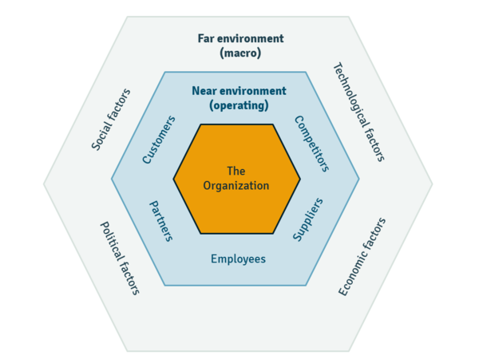

*Business Environments, ceopedia.org*

### گام دوم: محیط کلان

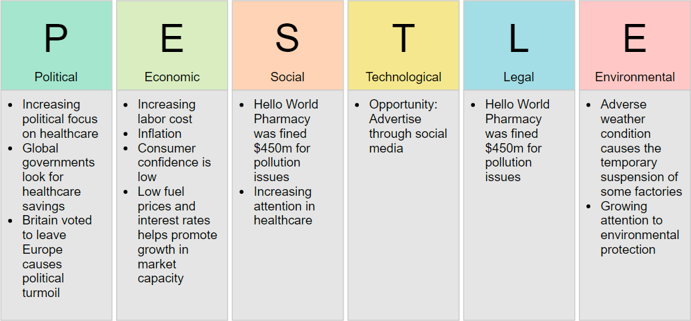

*visual-paradigm.com*

تجزیه و تحلیل PESTEL چارچوبی است که برای ارزیابی عوامل خارجی مؤثر بر یک سازمان استفاده می شود. مخفف **سیاسی، اقتصادی، اجتماعی فرهنگی، فناوری، حقوقی و زیست محیطی** است.

با استفاده از این چارچوب، می‌توانید فرصت‌ها و تهدیدهایی را که از محیط کلان به وجود می‌آیند شناسایی کرده و چگونگی تأثیر آنها بر عملکرد و استراتژی سازمان خود را ارزیابی کنید. تجزیه و تحلیل PESTEL می تواند به شما در درک پویایی بازار، روندها، چالش ها و خطرات در صنعت یا بخش خود کمک کند.

### گام سوم: محیط صنعت

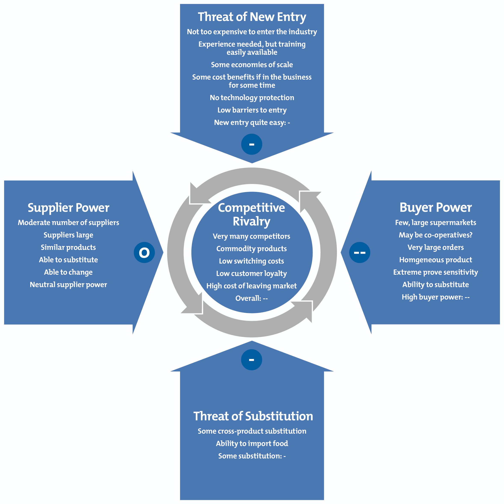

*mindtools.com*

پنج نیروی پورتر مدلی است که پنج نیروی رقابتی را که هر صنعت را شکل می‌دهند شناسایی و تحلیل می‌کند و به تعیین نقاط ضعف و قوت یک صنعت کمک می‌کند. این پنج نیرو عبارتند از:

- **تهدید تازه واردها**: درجه ای که رقبای جدید می توانند وارد بازار شوند و بازیگران موجود را به چالش بکشند.
- **قدرت چانه زنی تامین کنندگان **: میزانی که تامین کنندگان می توانند بر قیمت و کیفیت نهاده هایی که به صنعت ارائه می کنند تاثیر بگذارند.
- **قدرت چانه زنی خریداران**: میزان تأثیر خریداران بر قیمت و کیفیت محصولات یا خدماتی که از صنعت خریداری می کنند.
- **تهدید محصولات یا خدمات جایگزین**: درجه ای که محصولات یا خدمات جایگزین می توانند نیازها یا خواسته های مشتریان را به عنوان محصولات یا خدمات صنعت برآورده سازند.
- **رقابت بین رقبای موجود **: میزان رقابت بازیکنان موجود با یکدیگر در قیمت، کیفیت، نوآوری، خدمات مشتری و غیره.

با استفاده از این مدل می توانید جذابیت و سودآوری یک صنعت را ارزیابی کرده و منابع مزیت و ضرر رقابتی را برای سازمان خود شناسایی کنید. تجزیه و تحلیل پنج نیروی پورتر می تواند به شما در تدوین استراتژی های موثر، موقعیت خود در بازار و پیش بینی تغییرات آتی در صنعت کمک کند.

### گام سوم: محیط سازمان

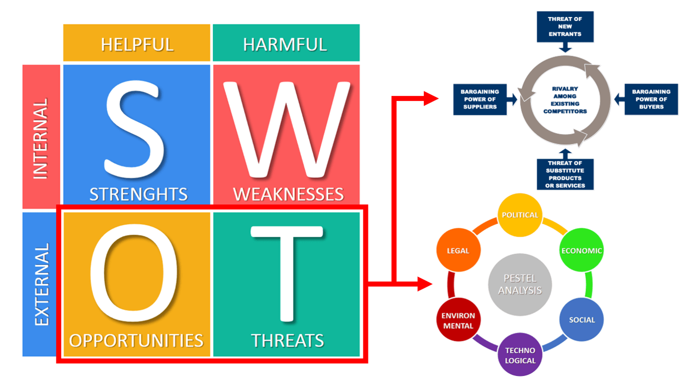

*business-to-you.com*

تحلیل SWOT چارچوبی است که برای ارزیابی موقعیت رقابتی شرکت و توسعه برنامه ریزی استراتژیک استفاده می شود. مخفف **قوت ها، ضعف ها، فرصت ها و تهدیدها** است.

با استفاده از این چارچوب، می توانید عوامل داخلی و خارجی موثر بر عملکرد و پتانسیل سازمان خود را شناسایی کنید. نقاط قوت و ضعف عوامل داخلی هستند که می توانید آنها را کنترل کنید، مانند منابع، قابلیت ها، مهارت ها و غیره. فرصت ها و تهدیدها عوامل خارجی هستند که نمی توانید آنها را کنترل کنید، مانند روند بازار، ترجیحات مشتری، رقبا، مقررات، و غیره.

تجزیه و تحلیل SWOT می تواند به شما در کشف بینش های جدید، کشف مسائل پنهان، اولویت بندی اهداف و ایجاد ایده های جدید برای عمل کمک کند. همچنین می‌تواند به شما کمک کند تا سازمان خود را با مأموریت، چشم‌انداز و ارزش‌هایش هماهنگ کنید. تجزیه و تحلیل SWOT می تواند برای یک پروژه خاص یا طرح تجاری کلی شما استفاده شود.

### گام چهارم: الگوی زمینه

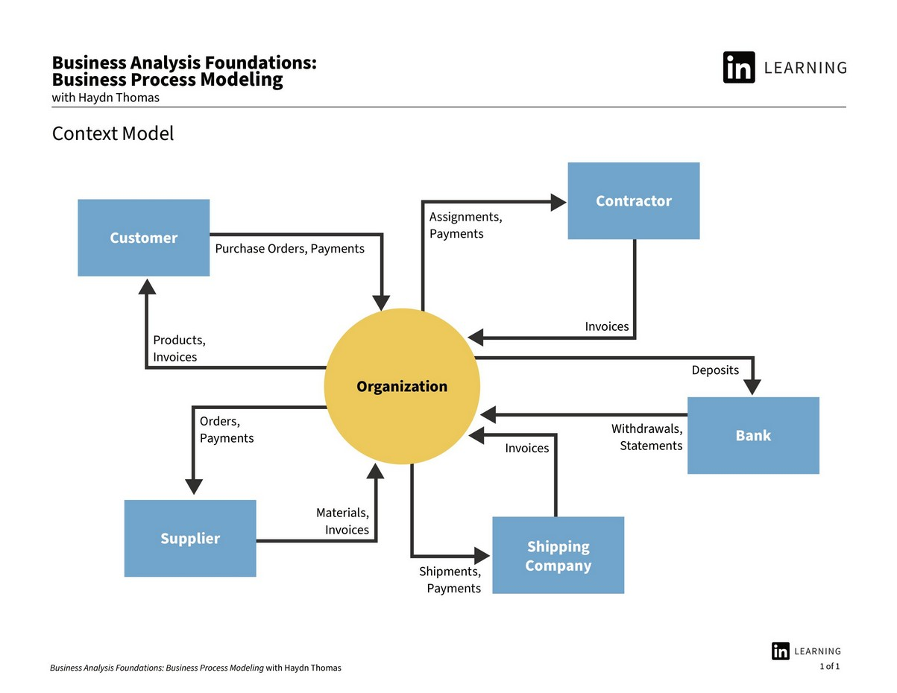

*Context Model*

مدل‌سازی فرآیند کسب‌وکار (BPM) فعالیتی است که فرآیندهای یک شرکت را به نمایش می‌گذارد، به طوری که فرآیندهای فعلی کسب‌وکار را می‌توان تجزیه و تحلیل، بهبود و خودکار کرد. معمولاً با استفاده از تکنیک‌های گرافیکی یا متنی برای ایجاد نمودارها یا فلوچارت‌هایی انجام می‌شود که مراحل، ورودی‌ها، خروجی‌ها، نقش‌ها و منابع درگیر در یک فرآیند را نشان می‌دهد.

مدل سازی فرآیند کسب و کار مزایای بسیاری برای سازمان ها دارد، از جمله:

- به شناسایی و حذف ناکارآمدی ها، خطاها، تنگناها و خطرات در فرآیندهای فعلی کمک می کند14.
- به طراحی و اجرای فرآیندهای جدید و بهبودیافته که با اهداف، ارزش‌ها و نیازهای مشتری سازمان همسو هستند، کمک می‌کند14.
- به برقراری ارتباط و مستندسازی فرآیندها به طور واضح و پیوسته با همه ذینفعان مانند کارکنان، مدیران، مشتریان، تامین کنندگان و غیره کمک می کند²³.
- به نظارت و اندازه گیری عملکرد و نتایج فرآیندها و ارزیابی تأثیر آنها بر موفقیت سازمان کمک می کند.

مدل زمینه مدل‌سازی فرآیند کسب‌وکار یک ابزار ارتباطی ساده است که برای به تصویر کشیدن زمینه یک کسب‌وکار، یک سیستم یا یک فرآیند استفاده می‌شود. زمینه محیطی است که هدف مورد علاقه ما در آن وجود دارد. یک مدل زمینه نحوه تعامل شی مرکزی با محیط خود را نشان می‌دهد، خواه در حال تبادل داده، اشیاء فیزیکی یا وجوه باشد.

مدل زمینه مدل‌سازی فرآیند کسب‌وکار مزایای زیادی برای سازمان‌ها دارد، مانند:

- به تعیین محدوده و مرزهای فرآیند یا سیستم کسب و کار و شناسایی بازیگران مربوطه و حوزه های مورد علاقه کمک می کند.
- به درک نیازها و انتظارات ذینفعان و مشتریان کمک می کند و آنها را با اهداف و ارزش های تجاری همسو می کند.
- به کشف فرصت ها و چالش های موجود در محیط خارجی و ارزیابی تأثیر آنها بر فرآیند یا سیستم تجاری کمک می کند.
- به ارائه یک نمای کلی در سطح بالا از فرآیند یا سیستم تجاری و وابستگی ها و روابط آن با سایر فرآیندها یا سیستم ها کمک می کند.

### گام پنجم: جریان‌های عملکردی

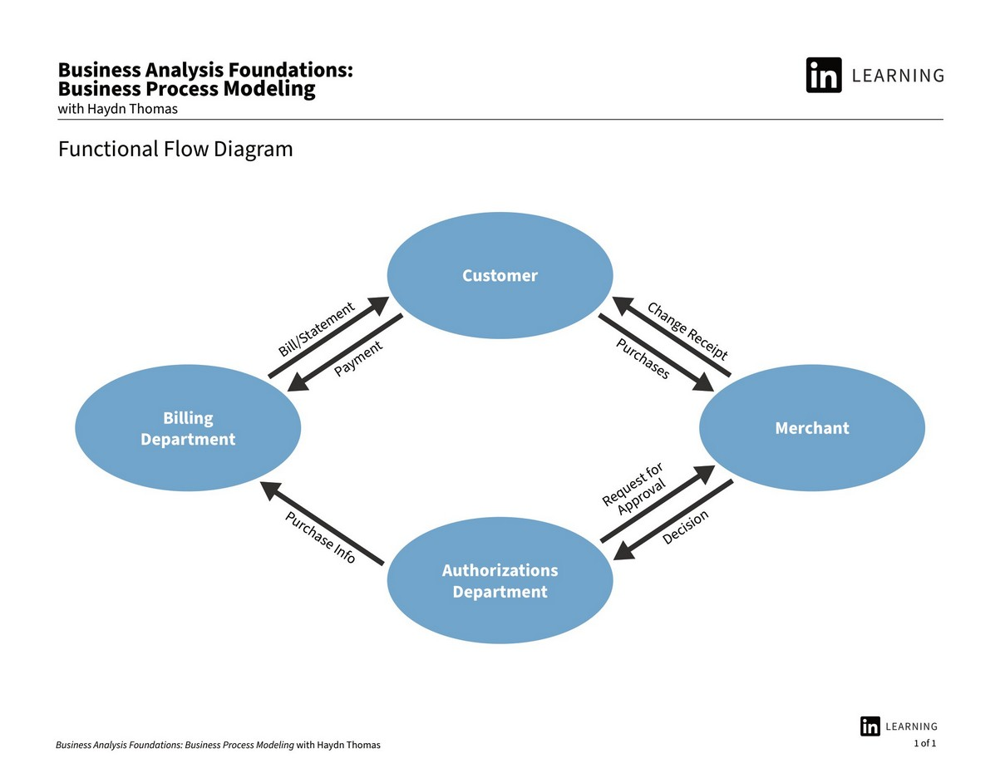

*Functional Flow*

جریان عملکردی مدل‌سازی فرآیند کسب‌وکار، نمایشی گرافیکی از رویدادها و فعالیت‌هایی است که در یک گردش کار رخ می‌دهند، همراه با مالکان، دستگاه‌ها، جدول‌های زمانی و نتایج هر مرحله. این یکی از تکنیک‌های کلاسیک مدل‌سازی فرآیند کسب‌وکار است، همراه با نمودارهای جریان، نمودارهای جریان داده، نمودارهای جریان کنترل، نمودارهای گانت، نمودارهای PERT و IDEF.

مدل‌سازی جریان عملکردی فرآیند کسب‌وکار مزایای زیادی برای سازمان‌ها دارد، مانند:

- به تجسم و درک منطق و توالی فرآیند یا سیستم تجاری و شناسایی ورودی‌ها، خروجی‌ها و وابستگی‌های هر مرحله کمک می‌کند.
- به تجزیه و تحلیل و بهینه سازی عملکرد و کارایی فرآیند یا سیستم تجاری و حذف یا کاهش ضایعات، خطاها، تاخیرها و هزینه ها کمک می کند.
- به برقراری ارتباط و مستندسازی فرآیند یا سیستم کسب و کار به طور واضح و پیوسته با همه ذینفعان، مانند کارمندان، مدیران، مشتریان، تامین کنندگان و غیره کمک می کند.
- به استانداردسازی و خودکارسازی فرآیند یا سیستم تجاری و اطمینان از کیفیت و قابلیت اطمینان آن کمک می کند.

### گام ششم: جریان عملکردی متقابل

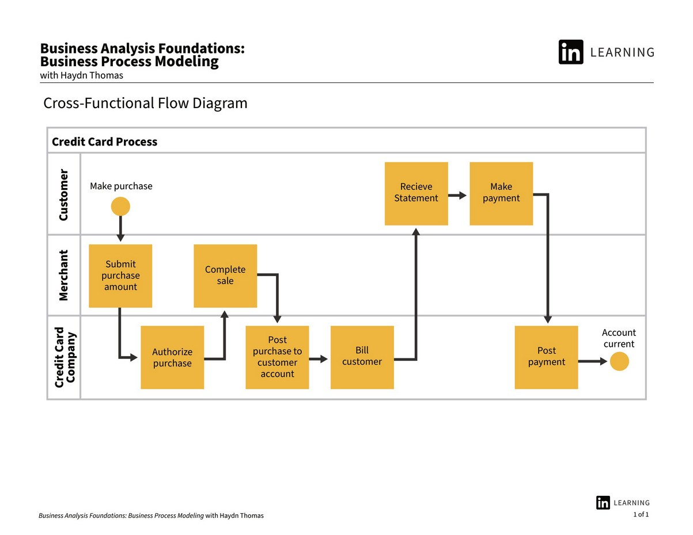

*Cross-Functional Flow*

نمودار جریان متقابل عملکردی مدل‌سازی فرآیند کسب‌وکار نوعی نمودار جریانی است که رابطه بین یک فرآیند تجاری و واحدهای عملکردی (مانند بخش‌ها یا موقعیت‌های) مسئول آن فرآیند را نشان می‌دهد. همچنین به عنوان نمودار جریان شنا شناخته می شود، زیرا فرآیند را به خطوط افقی یا عمودی تقسیم می کند که نقش ها یا نام های مختلف را نشان می دهد¹².

نمودار جریان متقابل مدل‌سازی فرآیند کسب‌وکار مزایای زیادی برای سازمان‌ها دارد، مانند:

- به تجسم و درک نقش ها و مسئولیت های هر واحد عملکردی در فرآیند کسب و کار و نحوه تعامل آنها با یکدیگر کمک می کند³².
- به تجزیه و تحلیل و بهینه سازی همکاری و هماهنگی بین واحدهای عملکردی مختلف و بهبود کیفیت و سرعت فرآیند کسب و کار³² کمک می کند.
- به برقراری ارتباط و مستندسازی فرآیند کسب و کار به طور واضح و پیوسته با همه ذینفعان مانند کارکنان، مدیران، مشتریان، تامین کنندگان و غیره کمک می کند³².
- به شناسایی و حذف شکاف‌ها، همپوشانی‌ها، تعارض‌ها یا افزونگی‌ها در فرآیند کسب‌وکار کمک می‌کند و از همسویی آن با اهداف و ارزش‌های سازمانی اطمینان حاصل می‌کند.

### گام هفتم: پردازش

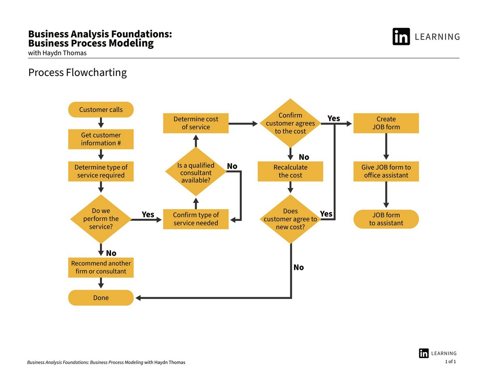

*Process Flowchart*

فلوچارت فرآیند مدل‌سازی فرآیند کسب‌وکار یک نمایش گرافیکی از مراحل و فعالیت‌هایی است که یک فرآیند تجاری را تشکیل می‌دهند، از ابتدا تا انتها²4. یکی از رایج‌ترین و ساده‌ترین تکنیک‌ها برای مدل‌سازی فرآیند کسب‌وکار است که از نمادها و اشکال استاندارد برای نشان دادن توالی، جهت و جریان اطلاعات در یک فرآیند استفاده می‌کند.

فلوچارت فرآیند مدلسازی فرآیند کسب و کار مزایای بسیاری برای سازمانها دارد، مانند:

- به تجسم و درک منطق و توالی فرآیند کسب و کار و شناسایی ورودی ها، خروجی ها و تصمیمات هر مرحله34 کمک می کند.
- به تجزیه و تحلیل و بهینه سازی عملکرد و کارایی فرآیند کسب و کار و حذف یا کاهش ضایعات، خطاها، تاخیرها و هزینه ها کمک می کند34.
- به برقراری ارتباط و مستندسازی فرآیند کسب و کار به طور واضح و پیوسته با همه ذینفعان، مانند کارمندان، مدیران، مشتریان، تامین کنندگان و غیره کمک می کند34.
- به استانداردسازی و خودکارسازی فرآیند کسب و کار و اطمینان از کیفیت و قابلیت اطمینان آن کمک می کند.

## دومین پناه‌گاه: مهندسی نرم‌افزار

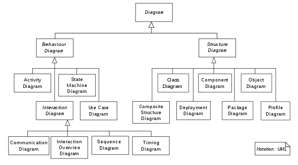

*[pinterest.co.uk](https://www.pinterest.co.uk/pin/hierarchy-of-uml-22-diagrams-shown-as-a-class-diagram--525302744029631821/)*

UML مخفف Unified Modeling Language است که یک زبان مدل سازی بصری همه منظوره استاندارد شده در زمینه مهندسی نرم افزار²5 است. UML برای مشخص کردن، تجسم، ساختن و مستندسازی مصنوعات اولیه سیستم نرم‌افزاری مانند کلاس‌ها، اشیاء، مؤلفه‌ها، رابط‌ها، موارد استفاده و غیره16 استفاده می‌شود.

UML مزایای زیادی برای مهندسین نرم افزار دارد، مانند:

- به طراحی و ارتباط ساختار و رفتار سیستم نرم افزاری با استفاده از انواع نمودارها مانند نمودارهای کلاس، نمودارهای ترتیبی، نمودارهای حالت، نمودارهای فعالیت و غیره کمک می کند24.
- به تجزیه و تحلیل و تأیید الزامات و عملکرد سیستم نرم افزار و اطمینان از سازگاری و کامل بودن آن کمک می کند³4.
- به استفاده مجدد و یکپارچه سازی اجزا و چارچوب های نرم افزاری موجود و کاهش زمان و هزینه توسعه کمک می کند36.
- به مستندسازی و حفظ سیستم نرم افزاری کمک می کند و تکامل و انطباق آن را تسهیل می کند.

### گام هشتم: نمودار Use Case

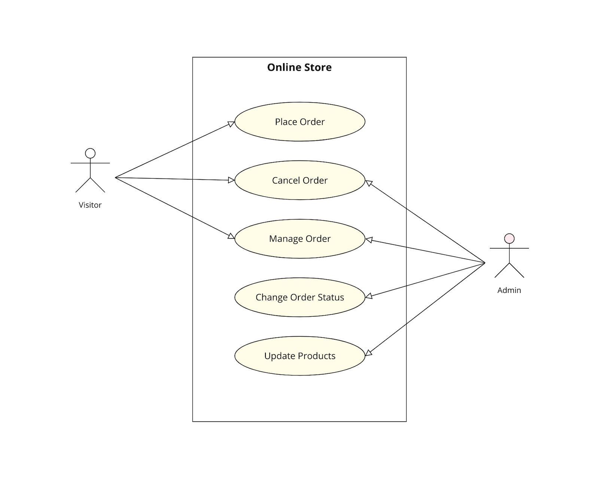

### گام نهم: نمودار پردازش و تعامل

[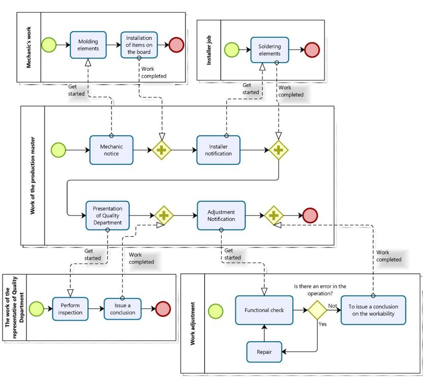](https://www.researchgate.net/figure/Diagram-of-processes-interaction-in-TDA2030-manufacturing_fig2_337223286)

*researchgate.net*

### گام دهم: وایرفریم

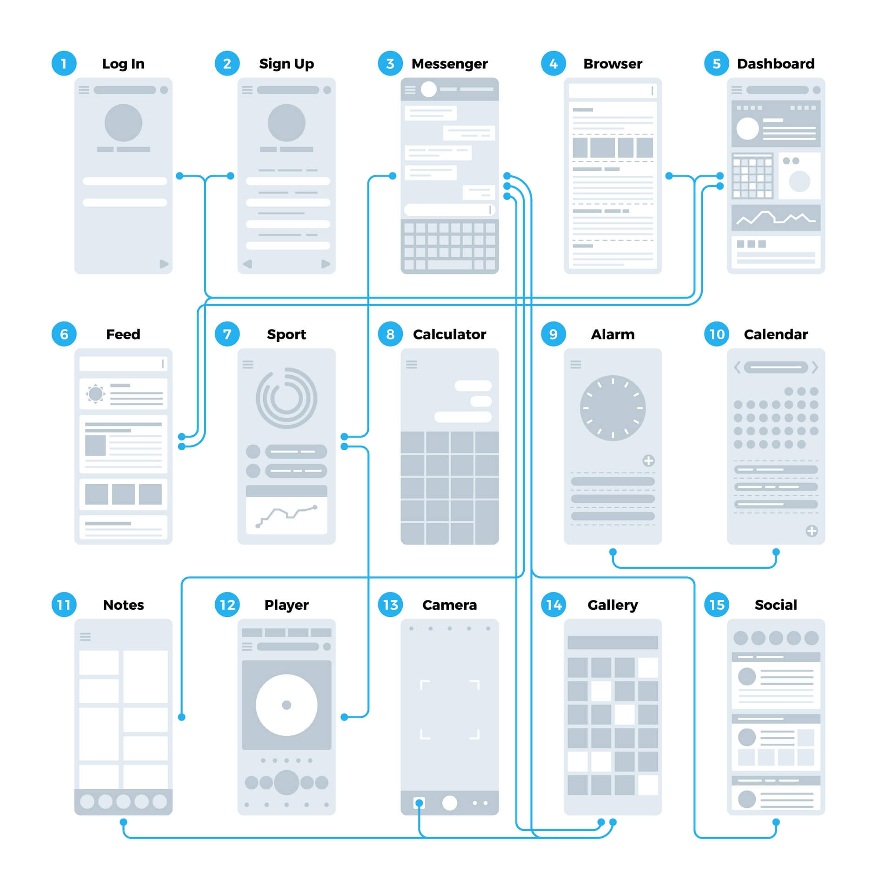

*[convergine.com](https://www.convergine.com/blog/from-concept-to-launch-how-wireframes-help-a-project-stay-on-budget/)*

### گام دهم: نمودار کلاس

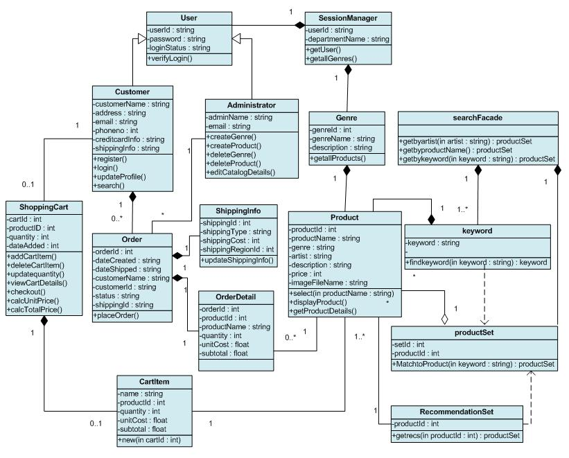

*[people.cs.ksu.edu](http://people.cs.ksu.edu/~reshma/798_ClassDiagram.htm)*

### گام یازدهم: معماری زیرساخت

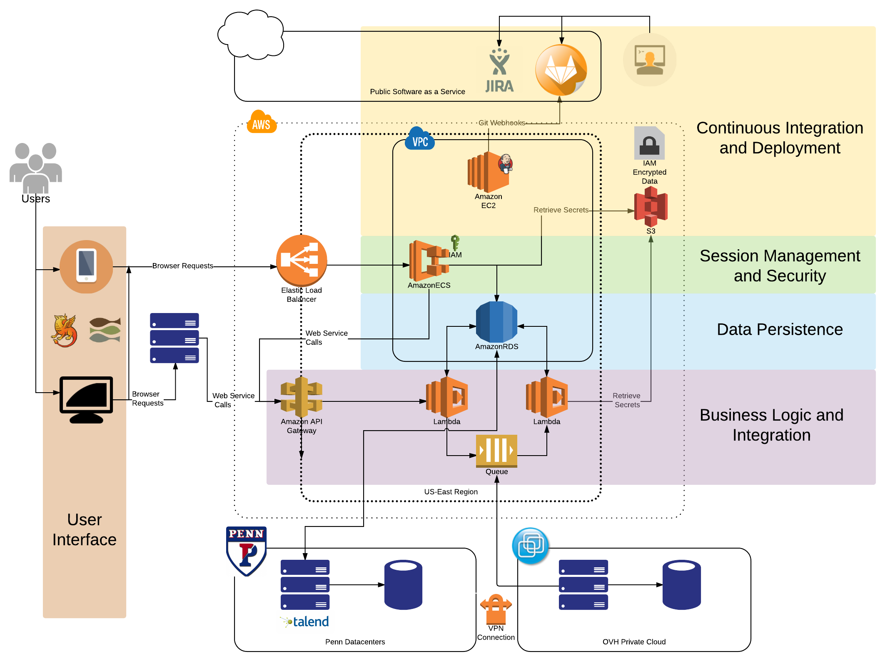

*[isc.upenn.edu](https://www.isc.upenn.edu/cloud-development-architecture-roadmap)*

## قله: مدیریت پروژه

#### گام یازدهم: نمودار گانت

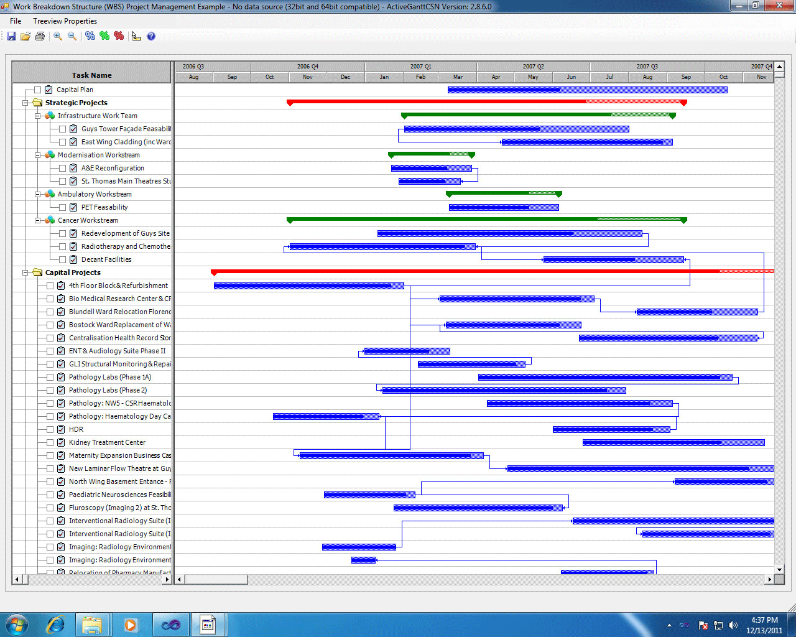

*[lucidchart.com](https://www.lucidchart.com/blog/gantt-chart-alternatives)*

#### گام دوازدهم: نمودار قله (خط زمانی)

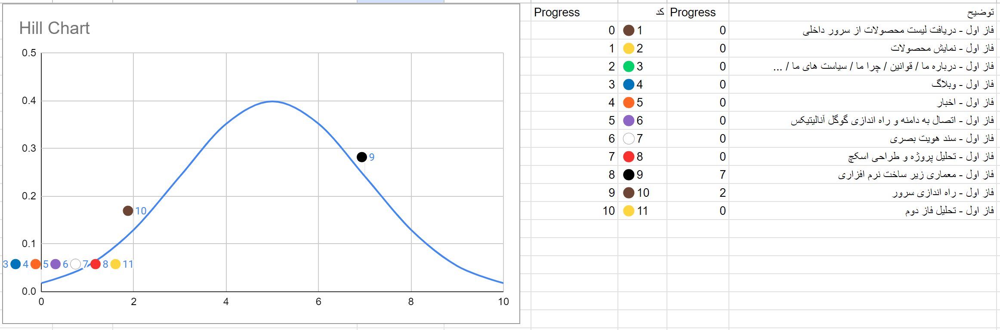

## تصمیم‌گیری برای مدیران در فناوری اطلاع

<video controls src="https://ftp.gordarg.com/training/suitable_web_platform.mp4"></video>

## منابع

- [اسلاید‌های ارائه رویداد استارتاپی سازمان ورزش و جوانان](https://github.com/tayyebi/javanan-2023/blob/main/javan.pdf)
- [اسلاید‌های ارائه رویداد استارتاپی دانشگاه علوم پزشکی](https://github.com/tayyebi/umsha-2023/blob/main/sense-make-decision.pdf)
- [PESTEL](https://sl.bing.net/t3touIzimG)  
  https://pestleanalysis.com/pestle-analysis-explained-with-examples/.  
  (2) PESTEL Analysis & Uses in Finance – موسسه مالی شرکتی. https://corporatefinanceinstitute.com/resources/management/pestel-analysis/.  
  (3) تجزیه و تحلیل PESTLE | CIPD. https://www.cipd.org/uk/knowledge/factsheets/pestle-analysis-factsheet/.
- [Porter 5 Forces](https://sl.bing.net/b9JumvAgfPU)  
  (1) 5 نیروی پورتر توضیح داده شده و نحوه استفاده از مدل – Investopedia. https://www.investopedia.com/terms/p/porter.asp.  
  (2) تحلیل نیروهای پنج گانه پورتر – ویکی پدیا. https://en.wikipedia.org/wiki/Porter%27s_five_forces_analysis.  
  (3) پنج نیرو – موسسه استراتژی و رقابت. https://www.isc.hbs.edu/strategy/business-strategy/Pages/the-five-forces.aspx.
- [SWOT](https://sl.bing.net/e1SvWLFhMpU)(1) تجزیه و تحلیل SWOT: چگونه با جدول و مثال – Investopedia. https://www.investopedia.com/terms/s/swot.asp.  
  (2) تجزیه و تحلیل SWOT – ویکی پدیا. https://en.wikipedia.org/wiki/SWOT_analysis.  
  (3) تجزیه و تحلیل SWOT: چیست و چگونه از آن استفاده کنیم (با مثال). https://asana.com/resources/swot-analysis.
- [BPM](https://sl.bing.net/RU3qwnfT9E)  
  (1) مدل سازی فرآیند کسب و کار – ویکی پدیا. https://en.wikipedia.org/wiki/Business_process_modeling.  
  (2) مدل سازی فرآیند کسب و کار چیست؟ – وبلاگ IBM. https://www.ibm.com/blog/business-process-modeling/.  
  (3) مدل‌سازی فرآیند کسب‌وکار: تعریف، مزایا و مثال‌ها – Kissflow. https://kissflow.com/workflow/bpm/business-process-modeling/.  
  (4) مدل سازی فرآیند کسب و کار: تعریف، مزایا و تکنیک ها. https://tallyfy.com/business-process-modeling/.  
  (5) Getty Images. https://www.gettyimages.com/detail/photo/businesswoman-writing-profit-business-process-royalty-free-image/507718500.
- [Context Diagram](https://sl.bing.net/jJtqHyBQc3g)  
  (1) یک مدل زمینه در 5 دقیقه – چرا تغییر؟ https://why-change.com/2021/02/09/a-context-model-in-5-minutes/.  
  (2) مدل زمینه کسب و کار. بهتر از این نمی شود. https://www.batimes.com/articles/the-business-context-model-as-good-as-it-gets/.  
  (3) استفاده از هستی شناسی و آگاهی از زمینه برای مدل سازی فرآیند کسب و کار: یک …. https://link.springer.com/chapter/10.1007/978-3-030-36778-7_57.  
  (4) مدلسازی و استفاده از زمینه در مدیریت فرآیندهای کسب و کار … – OpenScience. https://www.openscience.fr/IMG/pdf/mucv1n1a1santoro.pdf.
- [Functional Flow Diagram](https://sl.bing.net/fDXufSx0jIq)  
  (1) مدل سازی فرآیند کسب و کار چیست؟ – وبلاگ IBM. https://www.ibm.com/blog/business-process-modeling/.  
  (2) مدل سازی فرآیند کسب و کار: تعریف، مزایا و تکنیک ها – تالیفی. https://tallyfy.com/business-process-modeling/.  
  (3) نمودار بلوک جریان عملکردی – ویکی پدیا. https://en.wikipedia.org/wiki/Functional_flow_block_diagram.  
  (4) مدل سازی فرآیند کسب و کار – ویکی پدیا. https://en.wikipedia.org/wiki/Business_process_modeling.  
  (5) تکنیک های مدل سازی فرآیند کسب و کار با مثال – Creately. https://creately.com/blog/bpm/business-process-modeling-techniques/.
- [Cross Functional Flow Diagram](http://(1) یک فلوچارت متقابل کارکردی ایجاد کنید - پشتیبانی مایکروسافت. https://support.microsoft.com/en-us/office/create-a-cross-functional-flowchart-4a403033-9787-454f-b87e-b88452c47a21. (2) نمودار جریان متقابل: یک راهنمای کامل. https://www.zenflowchart.com/guides/cross-functional-flowchart. (3) نحوه استفاده از نمودارهای جریان متقابل در برنامه ریزی تجاری. https://venngage.com/blog/cross-functional-flowchart/.)  
  (1) یک فلوچارت متقابل کارکردی ایجاد کنید – پشتیبانی مایکروسافت. https://support.microsoft.com/en-us/office/create-a-cross-functional-flowchart-4a403033-9787-454f-b87e-b88452c47a21.  
  (2) نمودار جریان متقابل: یک راهنمای کامل. https://www.zenflowchart.com/guides/cross-functional-flowchart.  
  (3) نحوه استفاده از نمودارهای جریان متقابل در برنامه ریزی تجاری. https://venngage.com/blog/cross-functional-flowchart/.
- [Process Flowchart](https://sl.bing.net/UrYSAVh2O)  
  (1) نماد مدل سازی فرآیند کسب و کار چیست | لوسیدچارت. https://www.lucidchart.com/pages/bpmn.  
  (2) مبانی مدلسازی و نمادگذاری فرآیندهای کسب و کار (BPMN). https://www.ibm.com/blog/bpmn/.  
  (3) همه چیز درباره نگاشت فرآیند کسب و کار، نمودارهای جریان و نمودارها. https://www.lucidchart.com/pages/business-process-mapping.  
  (4) مدل سازی فرآیند: Apa Itu، Komponen، Manfaat، dan Cara Membuat – Glints. https://glints.com/id/lowongan/process-modelling-adalah/.
- [UML](https://sl.bing.net/c4hHPOxmbaS)  
  (1) UML Tutorial – Javatpoint. https://www.javatpoint.com/uml.  
  (2) زبان مدل سازی یکپارچه – ویکی پدیا. https://en.wikipedia.org/wiki/Unified_Modeling_Language.  
  (3) UML برای مهندسین نرم افزار | نمودار UML | فهرست انواع نمودار UML …. https://www.conceptdraw.com/examples/what-is-uml-in-software-engineering.  
  (4) زبان مدلسازی یکپارچه (UML) چیست؟ – پارادایم بصری. https://www.visual-paradigm.com/guide/uml-unified-modeling-language/what-is-uml/.  
  (5) زبان مدلسازی یکپارچه (UML) | یک مقدمه – GeeksforGeeks. https://www.geeksforgeeks.org/unified-modeling-language-uml-introduction/.  
  (6) UML در مهندسی نرم افزار: هر آنچه که باید بدانید. https://www.theknowledgeacademy.com/blog/uml-in-software-engineering/.

---

## قوانین کلی برای تیم توسعه

## هر موجودیت داده فقط باید یک جا ذخیره بشه.

مثلاً اطلاعات کاربر فقط سرویس احراز هویت ذخیره می‌شه. بقیه سرویس‌ها باید از طریق API همون سرویس به درخواست دادن به اون اطلاعات دسترسی پیدا کنن، نه اینکه خودشون نگهش دارن.

## کدی که استفاده نمی‌شه رو پاک کن.

قبل از هر ریلیز یه سر بزنین به کدهایی که دیگه کاربرد ندارن. هرچی اضافه‌ست، بره بیرون.

## داکیومنت رو بذار جایی که لازم میشه.

کاربر نباید دنبال راهنما بگرده. بالای دکمه‌ها یا جاهایی که داره باهاش تعامل می‌کنه، راهنما باشه. همین‌جا، دم‌دست.

## هیچی بدیهی نیست.

فرض نکن بقیه همه چیز رو می‌دونن. همیشه توضیح بده، حتی چیزای ساده. بنویس طوری که کسی که از بیرون اومده هم راحت بفهمه.

## پیام‌های خطا باید واضح و قابل درک باشن.

وقتی خطا می‌دی، بگو چی شده، کجاست، و چطوری درستش کنیم. از پیام‌های مبهم مثل «یه مشکلی پیش اومده» استفاده نکن. مثال:

```
throw new DatabaseConnectionException("اتصال به دیتابیس برقرار نشد چون فایل تنظیمات رو پیدا نکردیم.");
```

## طراحی‌ات دفاعی باشه.

اگه چیزی ممکنه خراب بشه، براش راه چاره بذار. اطلاعات کافی بده که بشه راحت عیب‌یابی کرد. از پیش‌بینی شکست‌ها نترس—بهتره آماده باشی. خطا رو اولین جایی که ممکنه پیش بیاد هندل کن. نذار آخرین مرحله.

## گزارش‌گر باش.

هر روز یه گزارش کوتاه از کارهایی که کردی بنویس و بفرست. حتی کارای معمولی هم مهمن. توی نوشتن رسمی باش و از کلمات متنوع استفاده کن که بعداً راحت بشه پیداش کرد. هیچ‌وقت گزارش‌هاتو حذف نکن.

## چیزایی که برات جالبه رو با بقیه به اشتراک بذار

اگه به چیزی علاقه‌مند شدی، یا یه نکته‌ی جالب یاد گرفتی، اون رو نگه ندار—منتشرش کن.

## از کش استفاده نکن.

داده‌ها باید همیشه به‌صورت زنده از منبع اصلی‌شون خونده بشن. مگه اونایی که ذاتا انتظار تغییر ازشان نداریم. مثل مولتی‌مدیایی که تبدیل میشن به اندازه‌های مختلف. اگه مجبور شدید کش بذارید، باید دلیلش رو توضیح بدید و توی لیستی بذارید که هرچه سریع‌تر جایگزینش کنید.

- آموزش‌های کوچیک درست کن (مثلاً یه نکته‌ی فنی، یه تجربه، یا یه روش خاص توی کدنویسی).
- اونا رو توی وبلاگ تیم، کانال شخصی یا هرجایی که بقیه راحت پیدا کنن بذار.
- این کار باعث می‌شه هم دانش پخش بشه، هم خودت شفاف‌تر فکر کنی
