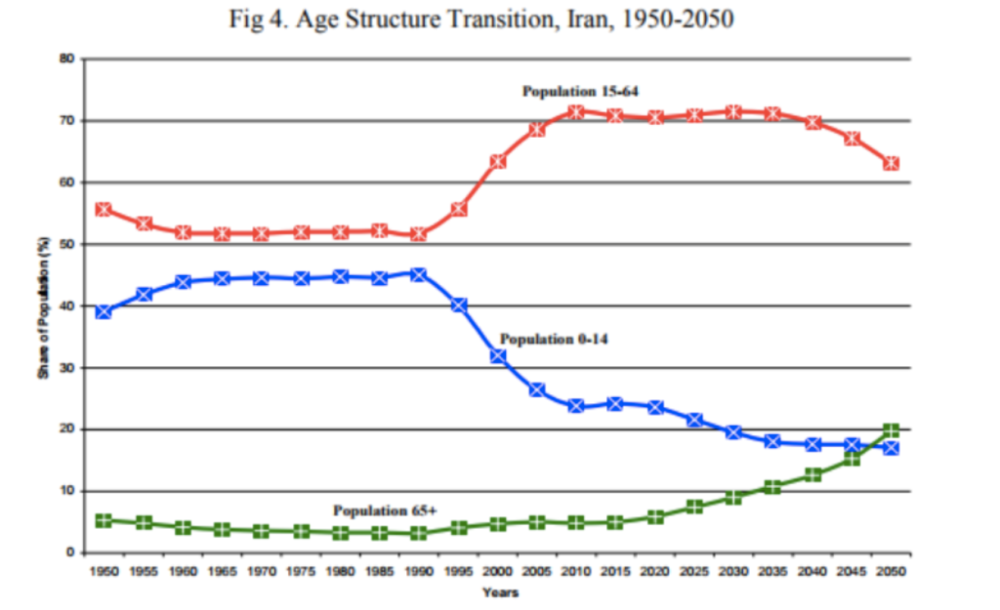
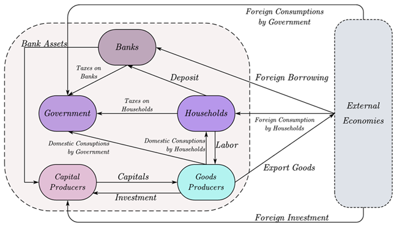

# اقتصاد کلان و آسیب‌های اجتماعی

## فصل اول

### طرح مسئله

مطالعه‌ی اقتصاد رشد به طور عمده به تبیین علل اختلاف زیاد بین درآمد سرانه‌ی کشورها ، اختلاف بین نرخ رشد اقتصادی کشورها و اختلاف بین سطح استاندارد زندگی در طی ادوار گذشته می‌پردازد.

نسبت دادن تفاوت درآمد بین کشورها به تفاوت در دانش، مشکل را حل نمی‌کند. به عبارت دیگر، باور آن مشکل است که دلیل آن‌که برخی کشورها فقیر هستند، عدم دسترسی آن‌ها به فناوری‌هایی باشد که در طول یک قرن گذشته رخ داده است. تفاوت در سطح دانش یا فناوری پیشرفته نیست، بلکه فقدان توانایی در استفاده از فناوری است.

علت ضعف برخی مدل‌ها در توضیح رشد عملکرد اقتصادی این است که فقط عوامل تعیین‌کننده‌ی تولید را در نظر گرفته و عوامل موثری چون زیرساخت‌های اجتماعی منظور نمی‌شود.

وجود تمایز میان متغیر‌های احتماعی و سایر عوامل غیر اقتصادی در جوامع مختلف می‌تواند توضیح‌دهنده‌ی دیگری برای تفاوت رشد اقتصادی در جوامع مختلف باشد. به عنوان نمونه چنانچه وضعیت اجتماعی-اقتصادی در جامعه مناسب نباشد تمرکز بر سرمایه‌گذاری برای ارتقای سرمایه‌ی انسانی از طریق آموزش می‌تواند باعث رشد مهاجرت نخبگان در جامعه شود.

طبق تعریف، بازده اجتماعی فعالیت‌های رانت‌جویانه صفر است. در حالی که بازده اجتماعی فعالیت‌های تولیدی برابر با میزانی است که در امر تولید مشارکت می‌کنند.

طرفداران دیدگاه محرومیت اجتماعی اعقتاد دارند که ناهمواری‌های اقتصادی شرایط پر از تنشی را در جامعه ایجاد می‌کند؛ این شرایط پرتنش افراد را در معرض آسیب‌های اجتماعی مختلفی از جمله رفتار مجرمانه، جنون، فروپاشی، نهاد خانواده، خودکشی، اعتیاد و … قرار می‌دهد.

رونق اقتصادی در برخی مواقع می‌تواند اثرات عمیقی بر رشد آسیب‌ها و ناهنجاری‌ها در جامعه داشته باشد.

در ارتباط با مکانیسم اثرگذاری رشد اقتصادی بر آسیب‌های اجتماعی باید به کیفیت نهاد حاکمیت در جامعه نیز توجه داشت. شاخص حکمرانی، له عنوان نشان‌دهنده‌ی کیفیت حکومت به بررسی رابطه بین عملکرد حکومت و رضایت از زندگی می‌پردازد. در بیان شاخص‌های حکمرانی خوب به مواردی همچون ثبات سیاسی و مقاله با خشونت، کارایی و اثربخشی دولت، کیفیت قوانین و مقررات کنترل فساد اشاره شده است. مولفه‌ها: حق اظهارنظر و پاسخگویی، ثبات سیاسی و عدم خشونت، اثربخشی دولت، کیفیت تنظیم مقررات، حاکمیت قانون، و کنترل فساد.

### اهمیت موضوع

بلایای طبیعی ممکن است که باعث ویرانی و خسارت بر دارایی‌های بادوام شده و درآمد خانوار‌ها را کاهش دهد. کاهش ظرفیت درماندی منجر به کاهش مخارج کلی آن‌ها شده و به‌ویژه سرمایه‌گذاری کافی برای آموزش و سلامت انجام نمی‌گیرد. نتایج اقتصادی بلند‌مدت آتی تصمیمات خانوار، خود را به صورت کاهش منابع تولید و ایجاد کاستی در تشکیل سرمایه‌های فیزیکی و انسانی جدید و کاهش بهره‌وری عوامل تولید، نمایان می‌سازد.

در مورد آسیب‌های احتماعی نیز همچون بلایای طبیعی، به طور معمول ابعاد کوتاه‌مدت آن مورد توجه است، و مبارزه با آن‌ها پس از وقوع انجام می‌شود؛ ولی شناخت آثار بلندمدت این نوع از بلایا می‌تواند منجر به تغییر اولویت رویکرد اقدام، از مبارزه به پیشگیری باشد.

مولفه‌های اقتصادی همچون بیکاری، تورم، رکود و فقر و نابرابری از عوامل تعیین‌کننده‌ی گسترش آسیب‌های اجتماعی است.

به اعتقاد بکر (از پیشگامان گسترش ایده‌ی سرمایه‌ی انسانی): افراد تا اندازه‌ای در خودشان سرمایه‌گذاری می‌کنند که ارزشِ فعلیِ درآمدهایِ آینده‌یِ آن‌ها،فراتر از هزینه‌هایِ فعلیِ آن‌ها باشد. پس اقتصاد ضعیف درآمد‌های آینده را کاهش داده و منجر به آسیب اجتماعی می‌شود و همچنین هزینه‌های تشکیل سرمایه‌ی انسانی را می‌افزاید.

تله‌ی دائمی رشد پایین اقتصاد: در شرایط رکود تورمی اقتصاد، نه‌تنها امکان رفع معضل مسائل اجتماعی وجود ندارد بلکه افزایش آسیب‌های اجتماعی از طریقق تضعیف سرمایه‌های انسانی و اجتماعی، کاهش بهره‌وری و بازتخصیص منابع عمومی و خصوصی جامعه از تولید و سرمایه‌گذاری مولد به خدمات ناهنجاری‌های اجتماعی، می‌شود.

پنجره‌ی فرصت جمعیتی: دوره‌ای است که بیشتر از دو سوم جمعیت در سنین کار و فعالیت یعنی ۱۵ تا ۶۴ سالع حضور دارند. این گروه سنی فارغ از سایر مشخص‌های جمعیت‌شناختی، بالاترین احتمال اعتیاد  را به خود اختصاص می‌دهند. همچنین مطالعات تجربی حرم، بر نقش نرخ بیکاری سنین جوان در افزایش جرم تاکید دارند.

برخی کشورهای توسعه‌یافته‌ی آسیا که در دوره‌ی پایانی پنجره‌ی فرصت جمعیتی خود قرار دارند چون به خوبی توانسته‌اند از فرصتی جمعیتی پیش‌آمده برای توسعه‌ی کشور و بهبود رشد اقتصادی استفاده کنند، در حال حاضر با جمعیت سال‌خورده توانمندی مواجه‌اند که نه‌تنها باری بر دوش اقتصاد نیست، بلکه سرمایه‌های انباشت شده، در چرخه‌ی اقتصادی وارد شده و منجر به افزایش تولید شده است.

مطالعات تجربی، فقر را از مهم‌ترین پیامد‌های اقتصادی منفی طلاق برای زنان و فرزندان آنان معرفی می‌کنند. زمانی که طلاق رخ می‌دهد، تقسیم وظایف در خانواده از بین می‌رود و ممکن است باعق کاهش تلاش مردان در بازار کار گردد.

از طرفی، رونق اقتصادی ممکن است به طور موقت، فرصت‌های بازار کار را برای زنان افزایش دهد و در نتیجه زنان ارزش بیشتر در طلاق بیابند و میزان طلاق افزایش پیدا کند.

از مکانیزم‌های اثرگذاری اعتیاد بر اقتصاد می‌توان به کانال مخارج دولت اشاره کرد: اعتیاد حداقل از سه طریق افزایش بودجه در بخش درمان، افزایش جرایم و هم‌چنین هزینه‌های نگه‌داری معتادان و حبس مجرمان می‌تواند بر مخارج دولت اثرگذار باشد.

جرایم می‌توانند بر انگیزه‌ی افراد برای انباشت سرمایه‌های فیزیکی و پس‌انداز اثرگذار باشند.

فقر می‌تواند فرد را به سرقت و جرایم خشن ترغیب کند زیرا فعالیت‌های مجرمانه می‌تواند روشی باشد که مردم فقیرتر برای دستیابی کالاهای اقتصادی به کار گیرند. مطالعات تجربی اذعان دارند که عمده‌ی افرادی که تصمیم به اقدام تبهکارانه می‌گیرند شاغل هستند. یعنی اثرات فقر و بیکاری هر دور قابل توجه هستند.

محکومیت افراد باعث محدود شدن بازار کار برای افراد شده و تا حدود زیادی باعث خروج محکومان از بازار کار مشروع می‌گردد.

تحصیلات ممکن است باعث تغییر ترجیحات به صورت غیر مستقیم گردد که بر تصمیمات مجرمانه اثرگذار است؛ برای مثال تحصیلات ممکن است باعث افزایش بردباری و یا ریسک‌گریزی فرد گردد.

*یک نمودار بر اساس مدل DSGE*

## فصل سوم: عوامل اقتصادی و اجتماعی موثر بر طلاق

بر اساس نظریه‌ی مبادله احتماعی اگر جاذبه‌های درون زندگی مشترک نسبت به جذابیت‌های خارج آن برای یک فرد قوی‌تر باشد احتمالا تمایل به حفظ زندگی مشترک خواهد داشت. این نظریه فرض می‌کند استحکام زندگی مشترک تابع مستقیمی از مجموع جذابیت‌های درون زندگی مشترک و موانع مجدود کننده‌ی طلاق است. استحکام زندگی مشترک لزوما به معنی رضایت‌بخش بودن زندگی نیست.

اگرچه اعتقاد عامه‌ی مردم بر این است که احتمال جدایی افراد با درآمد بالا نسبت به سایر افراد بیشتر است اما نمی‌توان به شکل کلی بر رابطه‌ی مثبت درامد و طلاق تاکید کرد. اما برای مردانی که دستمزدشان در سطوح پایینی قرار دارد، رونق موجب کاهش ارزش ازدواح می‌شود.

مشتقت اقتصادی: شرایطی که تقاضای محیطی بیش از منابع و ظرفیت افراد برای پاسخگویی به آن‌هاست. مشقت اقتصادی استرس ایجاد می‌کند.

استاندارد زندگی زنان در پی طلاق کاهش می‌یابد. توانایی مالی مردان نسبت به گذشته در اثر طلاق با کاهش بیشتری همراه است. بر اساس برخی از مطالعات، ممکن است بیکاری و هزینه‌های طلاق موجب بهبود رابطه‌ی زوجین شود چرا که مردان و زنان دلایل خوبی برای اجتناب از طلاق در دوره‌های سخت اقتصادی دارند. زنان زمانی که تجربیات کاری کمتری داشته باشند به شوهران خود وابستگی بیشتری دارند و تمایل آن‌ها برای طلاق کمتر است. در شرایط اشتغال زنان و بیکاری مردان، احتمال طلاق بیشتر خواهد بود. هرچه درامد یک مرد بالاتر باشد نفع بیشتری در ازدواج نصیب او می‌شود.

حرکت اقتصاد از یک نقطه اوج به نقطه حضیض، مرحله‌ی رکود و حرکت از یک نقطه‌ی حضیض به یک نقطه‌ی اوج، مرحله‌ی رونق خوانده می‌شود.

نرخ طلاق و تورم و بیکاری رابطه‌ی مثبت دارند. بکر اثر تحصیلات زنان را بر طلاق نامشخص ارزیابی می‌کند لیکن نتیجه‌ی اولیه برخی پژوهش‌ها در ایران، رابطه‌ی مثبت میان طلاق و تحصیلات زنان را نشان می‌دهد. این درحالی است که مطابق نتایج رابطه‌ی منفی اشتغال زنان به‌ویژه زنان دارای تحصیلات عالی با نرخ طلاق در ایران مورد تایید است. چنانچه رشد تحصیلات و گسترش آموزش عالی زنان همراه با ایجاد فرصت‌های شغلی باشد، افزایش منابع درامدی خانواده منجر به ارزش انتظاری بالاتر زندگی زناشویی شده و به استحکام خانواده کمک می‌کند. در ایران رونق اقتصادی از عوامل استحکام خانوادگی به شمار آمده و موجب کاهش طلاق می‌شود.

اثر چرخه‌های تجاری بر رفتار طلاق در ایران نامتقارن است؛ به عبارتی دیگر، اثر رکود اقتصادی بر افزایش طلاق، بیشتر از اثر رونق اقتصادی بر کاهش طلاق است. نرخ طلاق با بیکاری رابطه‌ی مستقیم دارد. نتایج مطالعات داخلی، از اثر نامناسب تورم بر تداوم زندگی مشترک در خانواده‌های ایرانی حکایت دارد. در دوره‌های رکود با ایجاد فشارهای اقتصادی بر خانواده، احتمال طلاق افزایش می‌یابد. رابطه‌ی منفی اشتغال زنان دارای تحصیلات عالی با نرخ طلاق تایید می‌شود.

## فصل سوم: عوامل اقتصادی و اجتماعی موثر بر جرم در ایران

هنجارها، به عرف، آداب و رسوم و قانون دسته‌بندی می‌شوند. جرم به آن دسته از اعمال اشاره دارد که با توجه به هنجارهای اجتماعی به منزله‌ی اعمال انحرافی و ضد اجتماعی ارزیابی شده و مجازات به دنبال دارد.

ارتکاب جرایم همراه با قانون شکنی و از بین بردن آسایش و امنیت شهروندان، ریسک فعالیت‌های اقتصادی و هزینه‌های زندگی شهروندان را افزایش داده که نتیجه‌ی آن کاهش سطح رفاه اجتماعی است. هزینه‌های کنترل جرایم، به نوعی جایگزین هزینه‌های آموزش، مراقبت‌های بهداشتی، هزینه‌های بهداشت عمومی و دیگر وظایف عمومی خواهد شد.

جرم تا زمانی ارزشمند است که مطلوبیت مورد انتظار ارتکاب آن، از مطلوبیت خودداری از جرم بیشتر باشد. جرم زمانی جذاب‌تر خواهد بود که عدم مطلوبیت دستگیری اندک باشد. همچنین جرم زمانی جذابیت کمتر دارد که مطلوبیت اشتغال قانونی زیاد باشد؛ برای مثال در شرایط نرخ بیکاری پایین یا دستمزد بالا. کاهش جرم ممکن است از طریق کاهش مزایای جرم، یا هزینه‌های مجازات به وجود آید.

همچنین افزایش درامد موجود در فعالیت‌های قانونی به علت آموزش، انگیزه‌ی ورود به فعالیت‌های غیرقانونی را کاهش می‌دهد. محیط فردی تاثیرات قابل توجهی بر ترجیحات افراد به‌ویژه در مورد هنجارهای فردی دارد. نظریه‌های اقتصاد جرم، همچنان تنها روی خواسته‌ها متمرکز اند.

بی‌هنجاری: وضعیت بی‌قاعدگی در جامعه‌ی مدرن.

رویایی آمریکایی: هر کسی می‌تواند به موفقیت بزرگ دست یابد. مرتون تاکید دارد «رویای آمریکایی» به جای آنکه بر کسب موفقیت بر روش درست و صحیح تاکید داشته باشد بر کسب موفقیت و به دست آوردن پول به هر قیمتی در ارتباط است. در فرهنگ آمریکایی به تلاش مشروع برای موفقیت به اندازه‌ی کافی ارزش داده نمی‌شود. رویای آمریکایی این آرمان را تبلیغ می‌کند که فرصت‌های برابر در دسترس همگان قرار دارد. اما در حقیقت گروه‌های اقلیت محروم به این‌گونه فرصت‌های مشروع دسترسی ندارند. آن‌ها انگیزه‌های بالا پیدا می‌کنند اما از فرصت‌های آموزشی و شغلی لازم برای تحقق این جاه‌طلبی‌ها محروم‌اند.

نوآوری: شایع‌ترین پاسخ مجرمانه است که در آن فرد به اهداف موفقیت متعهد می‌ماند ولی از راه نامشروع برای نیل به آن‌ها استفاده می‌کند. اکثر جرایم درامدزا در این نحوه‌ی سازگاری قرار می‌گیرند. از نگاه مرتون نوآوری، شایع‌ترین حالت سازگاری انطباقی در میان اعضای طبقه‌ی پایین اجتماعی است.

در خرده فرهنگ بزهکار، شهرت به خشونت و پرخاشگری روشی برای به دست آوردن موقعیت است.

شکاف بین انتظارات و موقعیت‌های واقعی، منجر به خشم، عصبانیت و ناامیدی می‌شود. رفتار مجرمانه به احتمال زیاد زمانی بروز می‌کند که پاسخ به فشار از نوع خشم باشد. خشم زمانی حاصل می‌شود که فرد سیستم یا دیگران را برای تجربیات نامطلوب سرزنش می‌کند و خود را مقصر نمی‌داند. پیچیدگی رفتارهایی مانند بزه و جرم کمتر از رفتارهایی مانند راندن یک خودرو نیست و به الگو نیاز دارد. مجرمان کسانی هستند که می‌آموزند تحت شرایط خاص نقض قانون قابل قبول است و این موضوع تنها به گروه‌هایی که فرد با آن‌ها معاشرت دارد وابسته است. جرم انحراف از رفتارهای عادی است که به احتمال زیاد توسط قانون منع شده است. کاهش دستمزد کارگران غیر ماهر منجر به افزایش جرم می‌شود.

درامد بالاتر از فعالیت‌های قانونی کار را جذاب‌تر از جرم جلوه می‌دهد اما درامد قانونی بالاتر در یک منطقه اهداف سودآور بیشتری را برای جرم ایجاد می‌کند. در سوی دیگر درامدهای بالای فعالیت‌های قانونی، به معنای شرایط از دست‌رفته‌ی بیشتر در شرایط حبس است که این هزینه‌ی جرم، تاثیر منفی بر وقوع آن می‌گذارد. افراد ناموفق از موقعیت خود احساس ناامیدی می‌کنند و هرچه نابرابری بیشتر باشد این فشار بیشتر است. افزایش نابرابری می‌تواند یک اثر جبری بر کاهش آستانه‌ی اخلاقی فرد از طریق آن‌چه اثر حسادت نامیده می‌شود به دنبال داشته باشد. اثر نابرابری بر جرم معنادار و مثبت است.

افزایش تورم باعث کاهش دستمزد‌های واقعی نیروی کار می‌شود زیرا دستمزدهای اسمی غالبا متناسب با تورم تعدیل نمی‌شوند اما تورم نه‌تنها از طریق اقر درامدی موجب افزایش جرایم مالی می‌شود، همچنین افزایش قیمت برخی کالاها (به عنوان مثال افزایش بهای فلزات گران‌بها) می‌تواند سود‌آوری درگیر شدن در جرم مالی را به میزان قابل توجهی افزایش دهد.

از دیدگاه نظریه‌ی عمومی فشار، تورم می‌تواند عامل فزایند ایجاد فشار در افراد به دلیل فاصله میان اهداف و اسباب رسیدن به اهداف گردد. در نظریه‌ی فشار عمومی، افراد طبقه‌ی پایین موفقیت‌های مالی و اجتماعی خود را با وضعیت طبقه‌ی متوسط مقایسه کرده و به دلیل فشار ناشی از شکست در رسیدن به اهداف ارزشمند مثبت، به رفتار مجرمانه روی می‌آورند. نظریه‌ی فشار، مصرف مواد مخدر و ارتکاب جرایم را از نتیجه‌ی فشار جامعه شناختی وارد بر فرد می‌داند.

ارتقای تحصیلات و مهارت، امکان مشارکت در بازار کار قانونی را افزایش می‌دهد، همچنین نرخ دستمزد فعالیت‌های قانونی برای فرد افزایش می‌یابد در نتیجه هزینه فرصت رفتار غیرقانونی را برای فرد افزایش می‌دهد.

تحصیلات عالیه از طرفی هزینه فرصت سرقت را برای فرد افزایش داده و از سوی دیگر با اثرگذاری بر ترجیحات فرد، ارتکاب سرقت را تا حدودی از دایره‌ی انتخاب‌های او بیرون می‌کند.

طلاق می‌تواند آثار اجتماعی و روانی شدید بر فرد داشته و فرد را با فشارهای شدید جامعه شناختی مواجه کند. در نتیجه رابطه‌ی طلاق با سرقت بیشتر از جنبه‌ی اجتماعی قابل تحلیل است.

در شرایط رونق اقتصادی، فرصت‌های سودآور ارتکاب جرایم بیشتر است. نرخ سرقت با متغیرهای اقتصادی همچون درامد سرانه، رابطه‌ی منفی و معنادار دارد؛ و با تورم، بیکاری جوانان و فقر رابطه‌ی مثبت و معنادار دارد. رابطه‌ی منفی نرخ سرقت با نسبت مخارج دولت به تولید ناخالص داخلی استان، مورد تایید است به نحوی که به هر اندازه مخارج سرانه‌ی حقیقی دولت در بخش بهبود امنیت و شرایط اجتماعی جامعه افزایش یابد انتظار می‌رود که سرقت کاهش یابد. رابطه‌ی منفی شاخص ترکیبی نرخ بیکاری و تحصیلات نشان‌دهنده‌ی اثر غالب تحصیلات نسبت به نرخ بیکاری در بحث جرایم است.

پیشگیری از جرم به منظور حفظ و توسعه‌ی سرمایه‌ی انسانی، اولین الزام ایجاد عدالت حقوقی و قضایی است.

با توجه به نظریه‌های ساختار اجتماعی نیز، درامد ناکافی، فقر و نابرابری در جامعه، از عوامل موثر بر وفوع جرم در جامعه به شمار می‌آید.

متغیر‌های اجتماعی: سطح تحصیلات مردان، شهرنشینی، نرخ اعتیاد، نرخ طلاق  
متغیرهای اقتصادی: درآمد، سرانه، نرخ بیکاری، نرخ بیکاری جوانان، شاخص فقر، ضریب جینی

از بیکاری معمولا به عنوان متغیر نشان‌دهنده‌ی فقدان فرصت درامدزایی قانونی در مطالعات جرم‌سنجی یاد شده.

اثر مثبت و معنادار متغیر مجازی استان‌های با درامد بالا را می‌توان به فرصت‌های جذاب بیشتر در این استان‌ها برای جرم سرقت در این استان‌ها دانست. رابطه‌ی مثبت و معنادار شیوغ اعتیاد بر سرقت مورد تایید است.

## فصل چهارم: عوامل اقتصادی و اجتماعی موثر بر اعتیاد در ایران

اعتیار یک سیر است، هیچ کس از ابتدا نمی‌خواهد که معتاد شود. بیماری‌های روان‌پزشکی، شکست‌های اجتماعی، خانواده‌ی متزلزل و متشنج، ناوانی در برقراری ارتباط با دیگران و مصرف سیگار از عوامل زمینه‌ساز اعتیاد به شمار می‌آید. فشار دوستان هم‌سن‌و‌سال، ارضای کنجکاوی، احساس تعلق و ریسک‌کردن نیز عوامل موثر در باقی‌ماندن فرد در اعتیاد است.

از پی‌آمد‌های مهم اعتیاد، سلب آزادی است. همچنین فرد معتاد با محرومیت‌های اجتماعی مواجه است. در بیشتر بزهکاری‌ها پای اعتیاد در میان است. «مواد مخدر» و «سرقت» از بین ۱۶۰۰ عنوان مجرمانه، حدود ۸۰ درصد مجرمان را تشکیل می‌دهد.

ایران در همسایگی کشوری قرار دارد که به شواهد آمار بین‌المللی بزرگ‌ترین تولید کننده‌ی خشخاش در جهان بوده و حدود ۷۵ درصد سطح زیر کشت خشخاش در جهان را به خود اختصاص داده است.

در تئوری اعتیاد عقلایی که رویکرد اقتصاد و نورولوژی دارد، یک فرد به c اعتیاد پیدا می‌کند اگر افزایش در مصرف فعلی او از کالای c، میزان مصرف آینده از این کالا را افزایش دهد.

با توجه به نظریه‌ی تعارض، درآمد ناکافی، فقر و نابرابری اقتصادی در جامعه، از جمله عوامل موثر بر شیوع مواد مخدر در نظر گرفته می‌شود.

اگر شرایط اقتصادی جامعه چنان باشد که باعث ایجاد تشویش و استرس در فرد شود می‌تواند با کاهش مطلوبیت فعلی و افزایش مطلوبیت نهایی مصرف کالای اعتیادآور، منجر به گسترش اعتیاد در جامعه شود. فروش مواد مخدر تبدیل به راهکاری برای تحمل فقر شدید و کاهش شکاف درامدی افرادی می‌شود که از درامد کافی بهره‌مند نیستند، بدون مهارت هستند و بی‌سواد اند.

آگینو، سه منبع عمده‌ی فشار را اینگونه شناسایی می‌کند:

- فشار ناشی از شکست در رسیدن به اهداف ارزشمند؛
- فشار ناشی از حذف انگیزه‌های ارزشمند مثبت؛
- فشار ناشس از وجود محرک‌های منغی که شامل وقوع قطعی یا پیش‌بینی نشده‌ی عاملی است که فرد از آن بیزاری می‌جوید.

افرادی که در طول عمر خود مصرف مواد را تجربه نکرده‌اند، به طور معنا دارای میزان رضایتمندی آن‌ها از زندگی بیشتر است.

احتمال اعتیاد مردان از زنان، مردان مجرد نسبت به مردان متاهل، و در گروه‌های سنی ۳۰ تا ۵۰ سال افراد بیکار به افراد شاغل بیشتر است. نتایج برآرد الگوهای داده ترکیبی (پنل) نشان می‌دهد که نرخ شیوع اعتیاد با درآمد سرانه، سطح تحصیلات مردان، مخارج سرانه حقیقی دولت، رابطه‌ی منفی و معنادار دارد؛ و با تورم و ضریب چینی رابطه مثبت و معنادار دارد.

## فصل پنجم: رابطه‌ی آسیب‌های اجتماعی و رشد اقتصادی

رومر، سرمایه‌ی انسانی را منبع کارایی اقتصادی می‌داند. ربلو، انباشت مهارت‌های نیروی کار را به عنوان یک منبع رشد مستمر معرفی می‌کند.

سطح متوسط سرمایه‌ی انساین بر سطح فناوری تولید تاثیر می‌گذارد. سطح متوسط سرمایه‌ی انسانی بر کمیت نیروی کار موثر مورد نیاز، با فرض ثابت بودن فناوری تولید، اثرگذار است. توسعه‌ی فناوری منجر به افزایش بازده آموزش شده و در نتیجه اقتصاد از افزایش انباشت سرمایه‌ی انسانی بهره‌مند می‌شود. میزان تولید کالا‌ها بستگی به طراحی‌های جدیدی دارد که توسط بخش تحقیق و توسعه و به کمک سرمایه‌ی انسانی و دانش موجود ایجاد می‌شود. بنابراین کیفیت انباشت سرمایه‌ی انسانی برای نرخ تغییر فناوری اثر حیاتی دارد. سلامت باعث افزایش بهره‌وری نیروی کار می‌شود. اعتیاد به مواد مخدر می‌تواند به ویژه جوانان گروه سنی ۱۵ تا ۳۵ سال را که در حال انباشت سرمایه‌ی انسانی هستند تحت تاثیر قرار دهد. اثر اعتیاد بر بهره‌وری نیروی کا، تابعی از نوع و میزان مصرف مواد مخدر و همچنین عملکرد مورد نیاز در مشاغل است. اعتیاد بر مشاغلی که نیازمند سطح بیشتری از قضاوت، تمرکز همیشگی، حافظه‌ی فوری و مهارت‌های فنی است نسبت به مشاغلی که نیازمند نیروی کار فیزیکی است اثر تخریب‌کننده‌ی بیشتری دارد؛ در نتیجه جوامع توسعه‌یافته‌تر و مشاغل با مهارت بالاتر از ناحیه‌ی اعتیاد، آسیب‌های بزرگتری را متحمل می‌شوند.

ارو: تعادل عمومی، در جستجوی پاسخ به این مهم است که چگونه حجم وسیعی از کالا و تصمیمات ظاهرا مستقل از هم، ضمن برقراری تعادل میان عرضه و تقاضا، به تخصیص بهینه در اقتصاد نیز منجر می‌شود.

در صورتی که مصرف‌کننده برای یک دوره‌ی زمانی معین زنده باشد و پس از آن مصرف‌کننده‌ی بعدی جانشین وی شود، آن‌گاه به الگوی هم‌پوشانی نسلی تبدیل می‌شود.

درآمدهای دولت از مالیات نشات می‌گیرد و مخارج دولت نیز شامل اوراق قرضه و بهره‌ی آن خواهد بود. بنابراین مالیات ابزار سیاست مالی و نرخ بهره ابزار سیاست پولی خواهد بود. دولت تلاش دارد تا مخارج خود را از محل دریافت مالیات، فروش اوراق قرضه، و بخشی از درامدهای نفتی، متوازن نگه دارد. مخارج دولت در دو بخش پرداخت‌های هزینه‌ای (جاری) و تملک دارایی‌های سرمایه‌ای (عمرانی) است. تغییرات پایه‌ی پولی تابعی از تغییرات خالص بدهی دولت به بانک مرکزی و خالص ذخایر خارجی بانک مرکزی است.

نرخ بیکاری به صورت تفاضل لگاریتم عرضه‌ی نیروی کار و اشتغال تعریف می‌شود. نرخ طبیعی بیکاری به صورت نرخ بیکاری در حالت عدم چسبندگی دستمزدها تعریف می‌شود.

برخی شاخص‌ها دارای وقفه‌ی زمانی مورد نیاز برای اثرگذاری هستند؛ مانند تاثیر مخارج دولت و خانوارها بر شاخص‌های آموزش و سلامت.

بنگاه رقابت انحصاری با توجه به تقاضای بازار، قیمت محصول خود را به نحوی انتخاب خواهد کرد که سود وی حداکثر شود. این دسته از بنگاه‌ها قیمت خود را بر پایه‌ی جدید‌ترین نرخ تورم مشاهده شده تعدیل می‌کنند. بنابراین مسئله‌ی تصمیم‌گیری آن‌ها عبارت است از انتخاب سرمایه، نیروی کار، و قیمت به نحوی که هزینه (سود) با دستمزد حقیقی، نرخ بهره‌ی سرمایه و سطح عمومی قیمت‌ها و تابع تقاضای رابطه حداقل (حداکثر) شود.

## فصل ششم: اثربخشی سیاست‌های اقتصاد کلان با وجود آسیب‌های اجتماعی

فعالیت‌های بودجه‌ای یکی از کانال‌های اثرگذاری دولت بر رشد اقتصادی است. عدم تعادل در بودجه می‌تواند اثر کاهنده بر رشد اقتصادی داشته باشد. مخارج اجتماعی دولت در امور سلامت و کاهش فقر رابطه‌ی مستقیمی با رضایت‌مندی عمومی دارد.

نحوه‌ی تامین مالی هزینه‌ها بر رشد اقتصادی تاثیر می‌گذارد. افزایش مخارج دولت و تامین آن از طریق کسری بودجه، بر رشد اثر منفی دارد.

مالیات‌ها بع طور معمول خنثی نیستند و تصمیمات تخصصی عامل اقتصاد در موارد نظیر انتخاب بین ساعات کار و استراحت، رفتار و پس‌انداز، سوددهی نسبی صنایع مختلف، در هنگام پرداخت و عدم پرداخت مالیات متفاوت است. لذا مالیات در روند اقتصادی اخلال ایجاد می‌کند.

افزایش درامدهای نفت در کوتاه‌مدت به دلیل فراهم آوردن منابع بیشتر بر رشد اقتصاد اثر مثبت جای می‌گذارد. اما مطالعات انجام شده در چارچوب نحسی منابع طبیعی، جاکی از این امر است که کشورهایی که دارای منابع طبیعی هستند به دلیل اثرات اقتصادی و سیاسی وابستگی به وفور منابع طبیعی، از جمله بیماری هلندی، بی‌توجهی به آموزش و تمایل به فعالیت‌های رانت‌جویانه، در بلندمدت رشد اقتصادی مطلوبی ندارند.

مشروعیت و مقبولیت سیاست پولی در آن است که به بهبود شرایط اقتصادی کمک موثری کند.

هزینه‌ی بار تورم برای کسانی که امکان جایگزینی پول داخلی را داشته باشند کمتر است. تورم به مفهوم افزایش سطح عمومی قیمت‌های محصول است. هرگاه عامل تولید خاصی سهم مناسب خود را از افزایش قیمت به دست نیاورد، سهم آن به عامل یا عوامل دیگر منتقل می‌شود. عواملی که سهم مناسب خود را از افزایش قیمت کسب نکنند، بازندگان تورم و عواملی که بیش از سهم خود کسب کنند، برندگان این میدان هستند. اگر دستمزدها با نرخی کمتر از تورم رشد کنند، دستمزد واقعی کاهش و سود واقعی افزایش خواهد یافت. افزایش حجم پول می‌تواند در اثر گسترش اعتبار ارزان برای گروه‌های ذی‌نفع مختلف یا برای بنگاه‌ها به‌منظور حفظ اشتغال باشد. رشد حجم پول باعث ایجاد نوسانات چرخه‌ای در اقتصاد می‌شود. اگرچه رشد حجم پول در کوتاه‌مدت بر تولید و اشتغال موثر است ولی در بلندمدت مطابق با نظریه‌ی کلاسیک‌ها بی‌تاثیر بوده و فقط منجر به تورم می‌شود. اقتصاددانان کلاسیک به خنثی بودن پول معتقد بودند، کینزین‌ها بر این باور هستند که با اعمالب سیاست‌های پولی انبساطی وجوه قابل وام دادن بانک‌ها افزایش و لزا نرخ بهره کاهش می‌یابد. در بلند مت با حذف توهم پولی، میزان تولید و اشتغال کامل کاهش ولی سطح عمومی قیمت‌ها و دستمزد‌های اسمی افزایش می‌یابد. نتایج نشان می‌دهد که سیاست‌های پولی، کارایی و تاثیرگذاری کمتری نسبت به سیاست‌های مالی دارند. تکانه‌ی مثبت مخارج مصرفی و سرمایه‌ای دولت موجب افزایش تولید و کاهش مصرف در اقتصاد ایران خواهد شد. آسیب‌های اجتماعی باعث کاهش اثر مثبت مخارج دولت در بخش آموزش بر تولید شده و با اثر تورمی بیشتری همراه است. در حالت وجود آسیب‌های اجتماعی، اثر کاهندگی مخارج عمرانی دولت بر تورم کمتر است. هدف از اجرای سیاست‌های پولی ایجاد ثبات اقتصادی است. گسترش آسیب‌های اجتماعی منحر به کاهش اثربخشی سیاست‌های پولی در اقتصاد کلان می‌شود.
