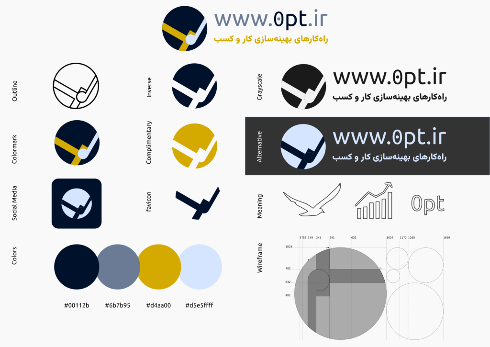

# سلام دنیا!

«موفقیت» راز نداره؛ اما چهارچوب‌های مختلفی براش هست. از چیزی که در زندگی شخصی به اسم «دیسیپلین» بیشتر می‌شناسیم، تا چیزی که معتقدیم «فرهنگ» ملت‌های پیشتاز رو تشکیل داده.

کسب و کارها، نیازها، ویژگی‌ها، و عوامل موفقیت زیادی دارن که خیلی بهم شبیه هستن. به همین دلیل، بسیاری از اندیشمندها چهارچوب‌هایی رو برای پاسخ به پرسش‌های مشترک ارائه کردن. این چهارچوب‌ها رو می‌شه توی دانشکده‌های مدیریت، زندگی‌نامه‌ها، و غیره پیدا کرد.

در طی ده سال گذشته که از سطوح پایین‌تر چارت سازمانی تا طبقه‌های بالای اون رو تجربه کردم، در مورد کسب و کاهای مختلف، متوجه پرسش‌هایی شدم که جواب‌های اون‌ها رو می‌شه در تجربه‌ی دیگران گرفت. پرسش‌هایی در رابطه با انضباط مالی، رضایت مشتری‌ها، رشد، و رقابت.

همچنین متوجه این موضوع شدم که بر خلاف عموم باورهایی که در مورد کسب و کارهای موفق شکل گرفته، اون‌ها هم به علم اعتماد دارن، از روش‌های علمی استفاده می‌کنن، و برای نتایج علم، اهمیت قائل هستند. اون‌ها آگاه هستند که هر نکته مکانی دارد، و هنر استفاده‌ی ظریف از دانسته‌ها رو به دست آوردن.

در همین راستا، تحصیلات خودم رو برای بازه‌ی زمانی کوتاهی از مهندسی دور کردم و وارد حوزه‌ی آکادمیک مدیریت کسب و کار شدم تا بتوانم بهتر چهارچوب‌های فکری مختلف رو برای حل مسائل مدیریت بشناسم، برای بزینس‌هایی که در اطرافم هستن و در نهایت مردم، مفید باشم.

برخی از صحبت‌هایی که با رهبران و مدیران کسب و کارها دارم، گاها تکرار می‌شن. و اگه این اتفاق بیافته به این معنیه که باید یک اپیزود از پادکست، یا یک یادداشت رو به خودش اختصاص بده. و اینطوری می‌شه که وب‌سایتی که پیش‌روی نگاه تیزبین و مهربان شماست، شکل گرفته.

## نشان و نام‌واره‌ی 0PT

اسم 0pt از واژه‌ی Optimization گرفته شده و کمی کوتاه و بهینه شده به این ترتیب، ذات بهینگی رو در خودش داره.

نشان هم ترکیبی از سه حرف OPT به نحویه که پرنده‌ای در حال پرواز و نمودارهای خطی رو تداعی کنه. رنگ‌های مشهور صنعت مشاوره کسب و کار و فاینانس (مالیه) برای طرح استفاده شدن اشکال هندسی در قالب نسبت‌های فیبوناچی در کنار هم قرار گرفتن.

برای تایپوگرافی هم بهینگی در این دیده شده که با کمترین توضیح، مخاطب از ماهیت پروژه مطلع بشه. مخاطب امروزه کاملا با ساختار آدرس وب‌سایت‌ها آشناست و توضیح اضافه‌ای رو نمی‌طلبه.

